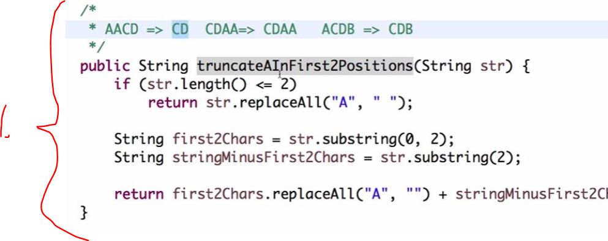
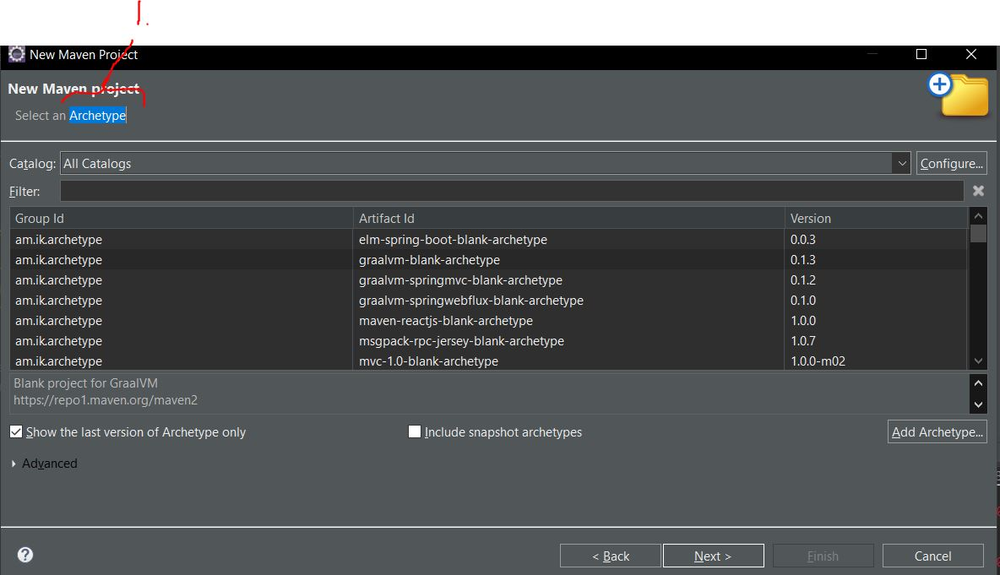
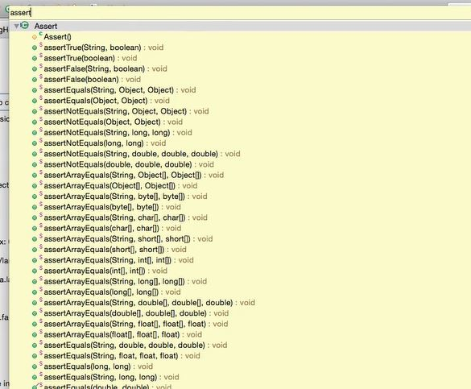
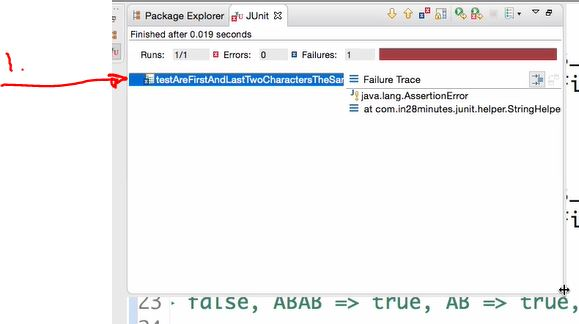
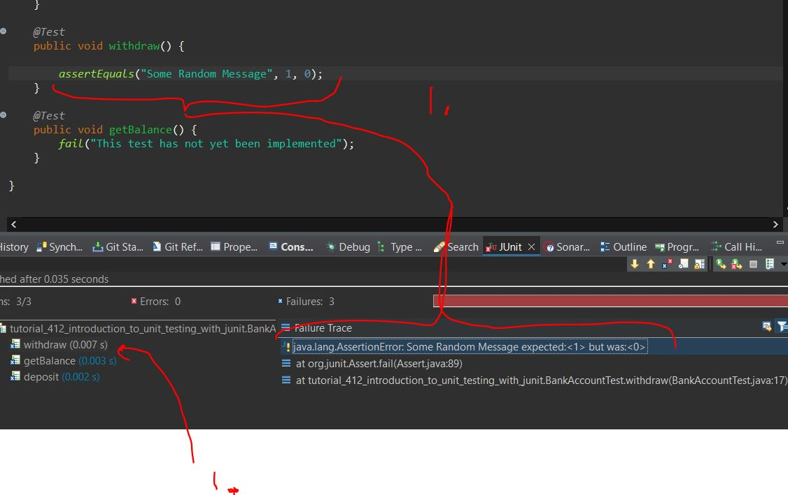
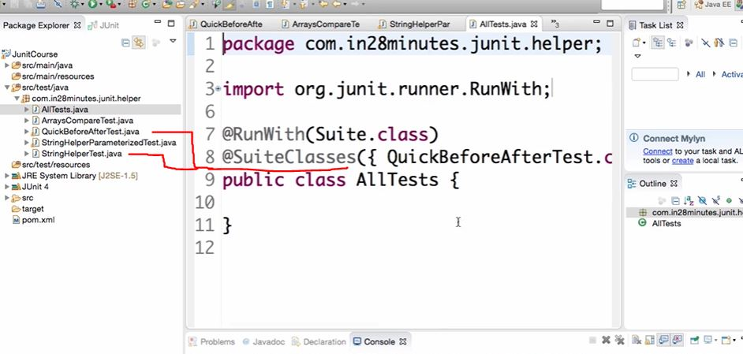

# Section 02: Unit Testing with Junit.

Unit Testing with Junit lecture.

# What I Learned.

# JUnit Step 1 : Why is Unit Testing Important?



- Old way to test this would be.
	- Push code to production.
	- Navigate to page where code is affected and test it thought UI.
		- Nowadays, we would write **Unit Tests** to test this.

1. This can be called **Unit**. Unit also can be:
	- Method().
	- Set of methods().
	- Set of classes.
- **Usually it means** you are testing one method or group of methods. 

# JUnit Step 2 : Setting up your first JUnit.



1. **Archetypes** are **Mavens** way to create sample projects.

- Here we are writing unit test for this **StringHelper** class.

```
public class StringHelper {

	public String truncateAInFirst2Positions(String str) {
		if (str.length() <= 2)
			return str.replaceAll("A", "");

		String first2Chars = str.substring(0, 2);
		String stringMinusFirst2Chars = str.substring(2);

		return first2Chars.replaceAll("A", "") + stringMinusFirst2Chars;
	}
	
	public boolean areFirstAndLastTwoCharactersTheSame(String str) {

		if (str.length() <= 1)
			return false;
		if (str.length() == 2)
			return true;

		String first2Chars = str.substring(0, 2);

		String last2Chars = str.substring(str.length() - 2);

		return first2Chars.equals(last2Chars);
	}

}
```

- Unit test should not be in `src/main ` folder, when application is builded it will go to complied source.

# Step 03 : First Successful JUnit. Green Bar and assertEquals.

- Test will assert stuff. Asserts have usually `actual` and `expected` value. `assertEquals("ABC", "ABCD");`.

- Remember **expected** is first and second one **actual**.

# Step 04 : Refactoring Your First JUnit Test.

- Writing second test.

```
@Test
	void testTruncateAInFirst2Postions_AinFirstPosition() {
		StringHelper helper = new StringHelper();
		assertEquals("CD", helper.truncateAInFirst2Positions("ACD"));
	}
```

# Step 05 : Second JUnit Example assertTrue and assertFalse.

- **AssertEquals** fails if comparing fails.

- In test world, absence of failure is **success**



- There is a lot of test methods in library to use 

<br>



<br>



1. If you name test method names correctly you **don't** necessary need condition name(You can use other version of **Assert** to display error messages, but if name of method is correctly written this is **often unnecessary**). You can see clearly which test fails.

 # Step 06 : @Before @After and Step 07 : @BeforeClass @AfterClass.

- If you need to use **System.out.println()** for printing, its recommended use  logger instead.

- `@After `After test is finished. We can close connection or clean up processes.

```
	@After
	public void teardown() {
		System.out.println("After test");
	}
```

- Class with @BeforeClass should be **static**.

# Step 08 : Comparing Arrays in JUnit Tests.

- Comparing arrays with `assertArrayEquals(expected, numbers);`.
	- Checks are they same values!

```
@Test
	public void testArraySort_RandomArray() {
		int[] numbers = { 12, 3, 4, 1 };
		int[] expected = { 1, 3, 4, 12 };
		Arrays.sort(numbers);
		assertArrayEquals(expected, numbers);
	}
```

# Step 09 : Testing Exceptions in JUnit Tests.

- Testing exception with **expected**.
	- Old way is to use try-catch.

- Newer way is use **expected** inside method name.

```
	@Test(expected=NullPointerException.class)
	public void testArraySort_NullArray() {
		int[] numbers = null;
		Arrays.sort(numbers);
	}
```

# Step 10 : Testing Performance in JUnit Tests.

- Testing with time, we would want to it be executed in **specific time**.
	- Using **timeout** annotation `@Test(timeout=100)`.
- We can use this to test performance.

```
	@Test(timeout=100)
	public void testSort_Performance(){
		int array[] = {12,23,4};
		for(int i=1;i<=1000000;i++)
		{
			array[0] = i;
			Arrays.sort(array);
		}
	}
```

# Step 11 : Parameterized Tests.

- Parameterized Tests help to make many test asserts with ease.

- Parametrized test needs:
1. `@RunWith(Parameterized.class)` annotation with class which is going to make Parameterized tests.
2. `@Parameters` for method which is going to make all the work and parameters.
3. Constructor and local variables.

- Example below


```
@RunWith(Parameterized.class)
public class StringHelperParameterizedTest {

	// AACD => CD ACD => CD CDEF=>CDEF CDAA => CDAA

	StringHelper helper = new StringHelper();
	
	private String input;
	private String expectedOutput;
	
	public StringHelperParameterizedTest(String input, String expectedOutput) {
		this.input = input;
		this.expectedOutput = expectedOutput;
	}

	@Parameters
	public static Collection<String[]> testConditions() {
		String expectedOutputs[][] = { 
				{ "AACD", "CD" }, 
				{ "ACD", "CD" } };
		return Arrays.asList(expectedOutputs);
	}

	@Test
	public void testTruncateAInFirst2Positions() {
		assertEquals(expectedOutput, 
				helper.truncateAInFirst2Positions(input));
	}
}
```

# Step 12 : Organize JUnits into Suites.

- To run specific tests and  **not all**! We wan't create test suite.



- Use case would be, if we have memory tests or performance test. We would not want to run them frequently.

- **Suite class**, needs to annotated with `@RunWith(Suite.class)`.

# How to remember things for long time.

- Take notes and review them often