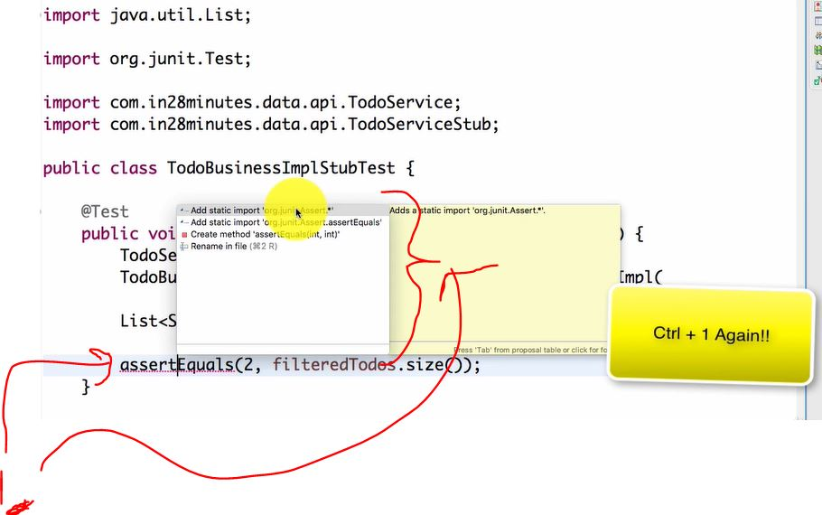
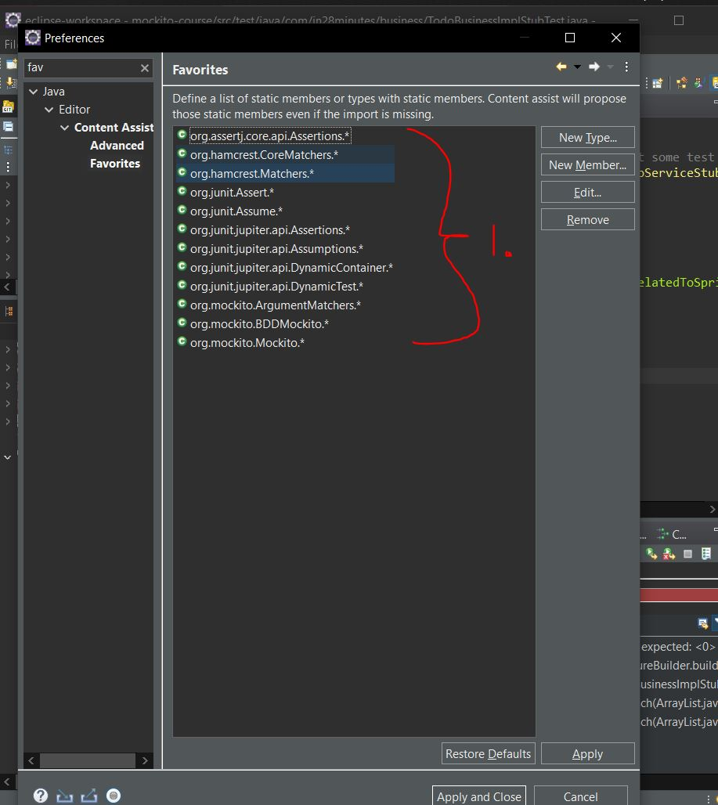
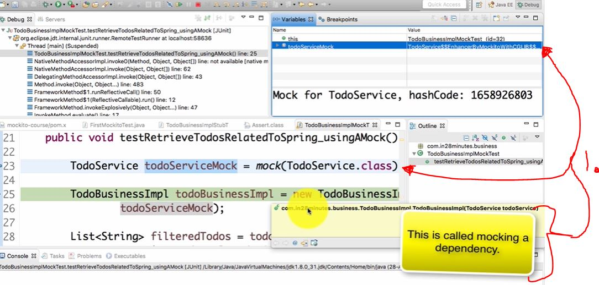
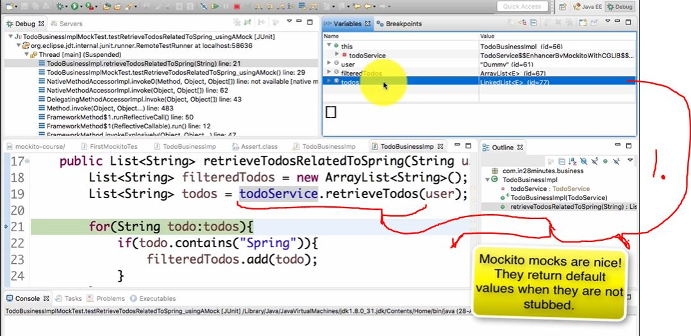

## Section 04 Need For Mockito

Need For Mockito.

# What I Learned

# Overview of this Section

- To understand **Mockito**, we need to make service and some business logic.

# Mockito Step 02 : Setting up SUT (System Under Test)

- We make business logic for test/mockito.

## TodoService.java

```

import java.util.List;

// External Service - Lets say this comes from WunderList
public interface TodoService {
	public List<String> retrieveTodos(String user);
}
```

## TodoBusinessImpl.java

```
public class TodoBusinessImpl {
    //TodoBusinessImpl SUT
    //TodoService Dependency

	private TodoService todoService;

	TodoBusinessImpl(TodoService todoService) {
		this.todoService = todoService;
	}

	public List<String> retrieveTodosRelatedToSpring(String user) {
		List<String> filteredTodos = new ArrayList<String>();
		List<String> allTodos = todoService.retrieveTodos(user);
		for (String todo : allTodos) {
			if (todo.contains("Spring")) { //Related to spring
				filteredTodos.add(todo);
			}
		}
		return filteredTodos;
	}
}
```

- Our goal is to unit test `retrieveTodosRelatedToSpring()` this particular method.

- **SUT** <u>**S**</u>ystem <u>**U**</u>nder <u>**T**</u>est.

- We want to test **TodoBusinessImpl**, which is **SUT** in this case.
    - So, we mock `TodoService` **Dependency**.

# Step 03 : Stubbing Example - with Disadvantages of Stubbing

- What is the **Stub**.
    - Sample implementation  of service.
        - Therefore, we can use this to test **TodoBusinessImpl**.
- This is for returning some **sample data**.

## Stub implementation in Java

```
package com.in28minutes.data.api;

import java.util.Arrays;
import java.util.List;

public class TodoServiceStub implements TodoService {

	public List<String> retrieveTodos(String user) {
		return Arrays.asList("Learn Spring MVC", "Learn Spring", "Learn to Dance");
	}

}

```


- We write test case, using this **Stub**. These are fine for simple cases.
    - As you can see **Stub** will provide dummy data for test.
```

	@Test
	void testRetrieveTodosRelatedToSpring_usingAStub() {

		
		// Given - START
		
		TodoService todoServiceStub = new TodoServiceStub();// We put some test data with Stub
		TodoBusinessImpl todoBusinessImpl = new TodoBusinessImpl(todoServiceStub);
		
		// Given - END


		// When - START
		
		List<String> filteredTodos = todoBusinessImpl.retrieveTodosRelatedToSpring("Dummy");
		
		// When - END

		
		// Then - START

		assertEquals(2,	filteredTodos.size());
		// Then - END
		
	}

```

- **One Downside:** When we write more **test cases**, we need also write more logic to the **Stub** implementation.  
    - Meaning, it has **dynamic conditions**.
- Here we write another test case.

```
	@Test
	void testRetrieveTodosRelatedToSpring_usingAStub_secondCase() {


		
		// Given - START
		
		TodoService todoServiceStub = new TodoServiceStub();// We put some test data with Stub
		TodoBusinessImpl todoBusinessImpl = new TodoBusinessImpl(todoServiceStub);
		
		// Given - END


		// When - START
		
		List<String> filteredTodos = todoBusinessImpl.retrieveTodosRelatedToSpring("Dummy1");
		
		// When - END

		
		// Then - START

		assertEquals(0,	filteredTodos.size());
		// Then - END
		
	}

```

- Now we need to add logic to **TodoServiceStub** implementation to serve test cases. In this case for passing value of `Dummy1`. 
    - **This is not alway wanted!**(adding extra logic whenever business logic changes).

```
public class TodoServiceStub implements TodoService {

	public List<String> retrieveTodos(String user) {
		
		//When test cases grow, so does the stub size
		
		// ... here goes logic for other test cases
		
		return Arrays.asList("Learn Spring MVC", "Learn Spring", "Learn to Dance");
	}

}

```

- **Second Downside:** When Service interface grows, we need also write more logic to the **Stub** implementation. **AGAIN!!**.
    - Meaning, **Service Definition** property changes.

- Stubs brings **lot of maintenance headache**.
    - In other hand, stubs **are useful** in simple scenarios.

- **Mocks** are dynamic version of **stubs**.

# Notes, this lecture if it does not work 

```

Debugging Help For Next Lecture
If you get ExceptionInInitializerError in the next lecture, Use this dependency instead of mockito-all.


<dependency>
  <groupId>org.mockito</groupId>
  <artifactId>mockito-core</artifactId>
  <version>4.0.0</version>
  <scope>test</scope>
</dependency>


More details here - https://www.udemy.com/course/mockito-tutorial-with-junit-examples/learn/#questions/16057562/

```

#  Step 04 : Your first Mockito code! Hurrah!!!



1. If we don't import static method. The **Default** importing comes from junit, since it **standard across** Java platforms. This is type of suggestion does not come always for all methods. **Eclipse** is configured to do so!



1. You can configure what is being automatically promoted by intellisense. Example in **Eclipse**.

- What is **mocking**?
    - **Mock** creates object that simulates given behavior.
        - Unlike **stubs**, mocks are dynamically created from code - **at runtime**.
        - You can verify method calls and lot more from **mocks**.

- This is how mocking looks like.
    - Instead **hardcoding stub** and returning values. We create mock, which is more dynamic!
    - This called **"mocking"**.

- Mocking example below.

```
TodoService mockTodoService = mock(TodoService.class);
stub(mockTodoService.retrieveTodos("Parameter")).return("value");		
```

- mock() method is form Mockito class.



1. You can see mock is created. This is called **mocking  dependency**

<br>



1. You can see, `retrieveTodos()` return **empty array**, even thought we didn't tell it to return anything. This is feature called **Nice Mocks**.

- Instead of stubs, we write same logic with **mocks**. Example below.

```
@Test
	void testRetrieveTodosRelatedToSpring_usingAMock() {
		
		// Given - START
		TodoService mockTodoService = mock(TodoService.class);
		List<String> allTodos = Arrays.asList("Learn Spring MVC",
				"Learn Spring", "Learn to Dance");
		
		when(mockTodoService.retrieveTodos("Ranga")).thenReturn(allTodos);
		
		TodoBusinessImpl todoBusinessImpl = new TodoBusinessImpl(mockTodoService);
		
		// Given - END


		// When - START
		
		List<String> filteredTodos = todoBusinessImpl.retrieveTodosRelatedToSpring("Ranga");
		
		// When - END

		
		// Then - START

		assertEquals(2,	filteredTodos.size());

		// Then - END
		
	}
```

- `when(mockTodoService.retrieveTodos("Ranga")).thenReturn(allTodos);`.
	- When **Service method** is called with parameter **"Ranga"**, return me following answers. 
    - Instead creating stub, we created told mockito and told it about wanted behavior!
        - One of good thing about mock, is that now we can easily make new test and tell mockito to return different set of values.

- Two important methods
    - `mock()`
    - `when()`
	
- You can read trough [Mockito Docs](https://javadoc.io/static/org.mockito/mockito-core/5.11.0/org/mockito/Mockito.html)


