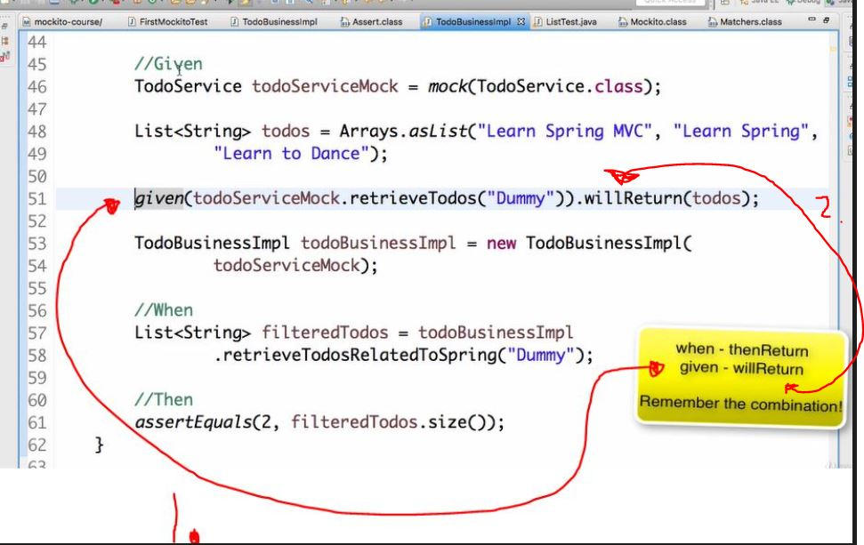
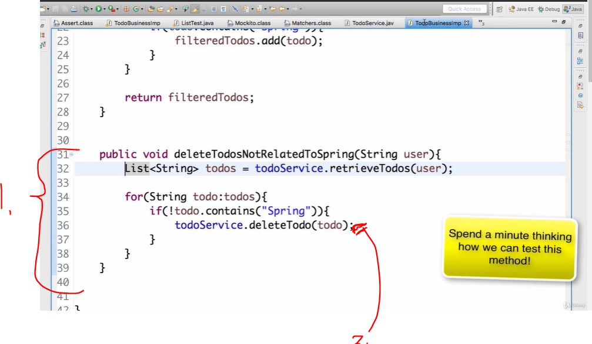

## Section 05 Mockito Basics

Mockito Basics.

# What I Learned


# Basics of Mockito - Section Overview

- BDD is interesting style to mock.

# Step 05 : Stubbing variations with Mockito - Argument Matchers & More...

- Mocking list class.

```
    @Test
    public void testMockListSize_ReturnMultipleValues()
    {
    	List listMock = mock(List.class);
    	when(listMock.size()).thenReturn(2).thenReturn(3);
    	
    	assertEquals(2, listMock.size());
    	assertEquals(3, listMock.size());
    }
```

- We can see **nice mocks** happening.

```
@Test
    public void testLetsMockListGet()
    {
    	List listMock = mock(List.class);
    	when(listMock.get(0)).thenReturn("in28Minutes");
    	
    	assertEquals("in28Minutes", listMock.get(0)); // Defined only for get(0) argument
    	assertEquals(null, listMock.get(1)); // Nice mocks happening here, not defined 
    }
```

- Second assert using **nice mocks**.
    - `assertEquals(null, listMock.get(1)); // Nice mocks happening`.

- Below is example to use `ArgumentMatchers`.

```
@Test
    public void testLetsMockListGetWithArgumentMatchers()
    {
    	List listMock = mock(List.class);
    	when(listMock.get(anyInt())).thenReturn("in28Minutes");    	
    	
    	assertEquals("in28Minutes", listMock.get(0)); 
    	assertEquals("in28Minutes", listMock.get(1));
    }
```

- Here we are using `anyInt()` **ArgumentMatchers**, it will accepts any int, meaning no need to write all different user cases.

- Throwing exception in Junit5 way.

```
    @Test
    public void testLetsMockListThrowsAnException()
    {
    	List listMock = mock(List.class);
    	
    	when(listMock.get(anyInt())).thenThrow(new RuntimeException("Something"));//Junit 5 way
    	
    	   assertThrows(RuntimeException.class, () -> {
    		   listMock.get(0);
           });
    	   
    }
 
```

# Step 06 : BDD Style - Given When Then

- **BBD** is about, splitting User Story into multiple **given when then** scenarios.

- **Given, When, Then** is good way to write test.
    - With **Mockito** there comes set of methods which helps to write tests in this way.
    - **Given**: should be everything setup.
    - **When**: when actions is happened.
    - **Then**: asserts here.



1. Mockito comes with **BDD** style names `given()`.
2. `willReturn()`.

- **Then** is having `assertThat(filteredTodos.size(), is(2));`, instead of `assertEquals(2,filteredTodos.size());`.
	- and even better is would be usage of `then(mockTodoService).should().deleteTodo("Learn to Dance");`.
- Changing to BDD style is more readable. 
    - Good way to make test **readable** to put BDD style.
    
- One method below as example.

```
@Test
	void testRetrieveTodosRelatedToSpring_usingBDD() {
		
		// Given - START
		
		TodoService mockTodoService = mock(TodoService.class);
		List<String> allTodos = Arrays.asList("Learn Spring MVC",
				"Learn Spring", "Learn to Dance");
		
		given(mockTodoService.retrieveTodos("Ranga")).willReturn(allTodos);
		
		TodoBusinessImpl todoBusinessImpl = new TodoBusinessImpl(mockTodoService);
		
		// Given - END


		// When - START
		
		List<String> filteredTodos = todoBusinessImpl.retrieveTodosRelatedToSpring("Ranga");
		
		// When - END

		
		// Then - START

		assertThat(filteredTodos.size(), is(2));

		// Then - END
		
	}
```


# Step 07 : Verify calls on Mocks

- We can verify if specific method is called.



1. Problem comes how to test this method. Since it does not return no value.
2. One way, is to verify calling of `todoService.deleteTodo()` is being called. Using `verify()`, example below.

- `verify(mockTodoService).deleteTodo("Learn to Dance");// Check if some method is called`. Checking if method was called with given parameter.

- To test method if it was **never** called. Its done with **never()** `verify(mockTodoService, never()).deleteTodo("Learn Spring MVC");// Check if some method is never called`.

- To test how many times method was called using **times()**
	- `verify(mockTodoService, times(1)).deleteTodo("Learn to Dance");// Check if some method is called`

- When methods does not return anything back, we want to check **side effects!**.

- Example below, using different mockito tests.

```
@Test
	void testDeleteTodosNotRelatedToSpring_usingBDD() {
		
		// Given - START
		
		TodoService mockTodoService = mock(TodoService.class);
		List<String> allTodos = Arrays.asList("Learn Spring MVC",
				"Learn Spring", "Learn to Dance");
		
		given(mockTodoService.retrieveTodos("Dummy")).willReturn(allTodos); // We need this for deleting
		
		TodoBusinessImpl todoBusinessImpl = new TodoBusinessImpl(mockTodoService);
		
		// Given - END


		// When - START
		
		todoBusinessImpl.delteTodosNotRelatedToSpring("Dummy");
		
		// When - END

		
		// Then - START

		
		then(mockTodoService).should().deleteTodo("Learn to Dance");// Check if some method is called
		//mockTodoService.deleteTodo("Learn to Dance"); // Unrelated to dance with dummy data
		then(mockTodoService).should(never()).deleteTodo("Learn Spring MVC");// Check if some method is never called
		
		// Then - END

		
	}
```


# Step 08 : Capturing arguments passed to a Mock


- There is Argument that is passed to mock and we want to **capture** it.

1. **Declare Argument Captor** `ArgumentCaptor<String> stringArgumentCaptor = ArgumentCaptor.forClass(String.class);`.
2. **Define Argument captor on specific method call** `then(mockTodoService).should().deleteTodo(stringArgumentCaptor.capture());.`
3. **Capture the argument** `assertThat(stringArgumentCaptor.getValue(), is("Learn to Dance"));`
		

- Below fully working test code.

```
@Test
	void testDeleteTodosNotRelatedToSpring_usingBDD_argumnentCapture() {

		//Declare Argument Captor
		ArgumentCaptor<String> stringArgumentCaptor = ArgumentCaptor.forClass(String.class);
		
		//Define Argument captor on specific method call
		//Capture the argument
		
		// Given - START
		
		TodoService mockTodoService = mock(TodoService.class);
		List<String> allTodos = Arrays.asList("Learn Spring MVC",
				"Learn Spring", "Learn to Dance");
		
		given(mockTodoService.retrieveTodos("Dummy")).willReturn(allTodos); // We need this for deleting
		
		TodoBusinessImpl todoBusinessImpl = new TodoBusinessImpl(mockTodoService);
		
		// Given - END


		// When - START
		
		todoBusinessImpl.delteTodosNotRelatedToSpring("Dummy");
		
		// When - END

		
		// Then - START

		then(mockTodoService).should().deleteTodo(stringArgumentCaptor.capture());

		assertThat(stringArgumentCaptor.getValue(), is("Learn to Dance"));
		
		// Then - END

	}
```