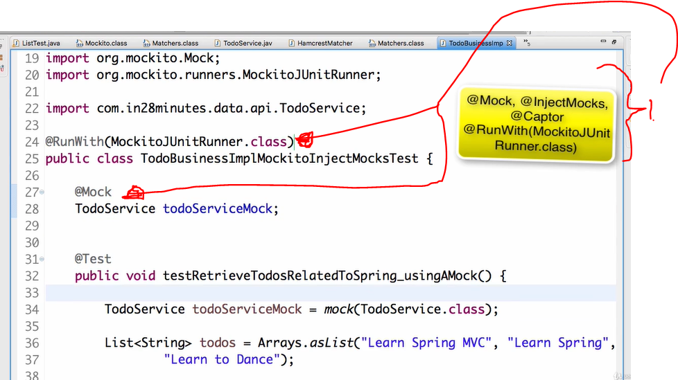
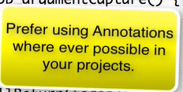
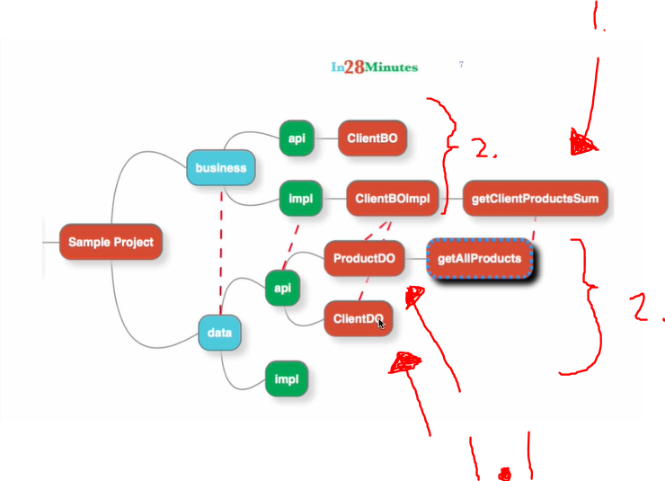
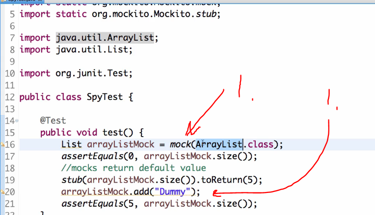

## Section 06  Mockito Advanced

 Mockito Advanced.

# What I Learned

# Step 09: Hamcrest Matchers

- These make test more readable.
    - **hamcrest-library** has many other asserts.


- **Hamcrest** assert POM at the time.

```
<dependency>
    <groupId>org.hamcrest</groupId>
    <artifactId>hamcrest-library</artifactId>
    <version>1.3</version>
    <scope>test</scope>
</dependency>  
```

- Different to use **hamscrest**.

```
@Test
	public void testName() throws Exception {
		
			List<Integer> scores = Arrays.asList(99, 100, 101, 105);
			assertThat(scores, hasSize(4));
			assertThat(scores, hasItems(100, 101));
			
			assertThat(scores, everyItem(greaterThan(90)));
			assertThat(scores, everyItem(lessThan(200)));

			// String
			assertThat("", isEmptyString());
			assertThat(null, isEmptyOrNullString());

			// Array
			Integer[] marks = { 1, 2, 3 };

			assertThat(marks, arrayWithSize(3));
			assertThat(marks, arrayContainingInAnyOrder(2, 3, 1));
	}
```

# Step 10 : Mockito Annotations - @Mock, @InjectMocks, @RunWith, @Captor..

- Another way to **mock** object is using **@annotations**.



1. To use these **annotation** we need add tell class to run with **runner**.

- With annotations following will line, `TodoService mockTodoService = mock(TodoService.class);` will be written as `@Mock TodoService mockTodoService;`.

- `@Mock` will **mock** objects which it will find. `@InjectMocks` annotation will be used also here to inject mocked dependencies.

```
	@Test
	void testRetrieveTodosRelatedToSpring_usingAMock() {
		
		// Given - START
		TodoService mockTodoService = mock(TodoService.class);
		List<String> allTodos = Arrays.asList("Learn Spring MVC",
				"Learn Spring", "Learn to Dance");
		
		when(mockTodoService.retrieveTodos("Ranga")).thenReturn(allTodos);
		
		TodoBusinessImpl todoBusinessImpl = new TodoBusinessImpl(mockTodoService);
		
		// Given - END


		// When - START
		
		List<String> filteredTodos = todoBusinessImpl.retrieveTodosRelatedToSpring("Ranga");
		
		// When - END

		
		// Then - START

		assertEquals(2,	filteredTodos.size());

		// Then - END
		
	}
	
```

- Will be after mocking annotations.

```
// Mock annotation will make this behind scenes
// TodoService mockTodoService = mock(TodoService.class);
	
	@Mock
	TodoService mockTodoService;
	
//	InjectMocks will remove this one
//	TodoBusinessImpl todoBusinessImpl = new TodoBusinessImpl(mockTodoService);
	
	@InjectMocks 
	TodoBusinessImpl todoBusinessImpl;
	
	
	
	@Test
	public void testRetrieveTodosRelatedToSpring_usingAMock() {
		
		// Given - START
		List<String> allTodos = Arrays.asList("Learn Spring MVC",
				"Learn Spring", "Learn to Dance");
		
		when(mockTodoService.retrieveTodos("Ranga")).thenReturn(allTodos);
		
		TodoBusinessImpl todoBusinessImpl = new TodoBusinessImpl(mockTodoService);
		
		// Given - END


		// When - START
		
		List<String> filteredTodos = todoBusinessImpl.retrieveTodosRelatedToSpring("Ranga");
		
		// When - END

		
		// Then - START

		assertEquals(2,	filteredTodos.size());

		// Then - END
		
	}
	
```


- Another good annotation is **@InjectMocks**.
    - Mockito **will figure out** needed decencies to construct object.  
    - Example of this. Old way to use this would be `TodoBusinessImpl todoBusinessImpl = new TodoBusinessImpl(mockTodoService);` and with annotation and new approach will be
    
```
@InjectMocks 
TodoBusinessImpl todoBusinessImpl; // Object is mocked and needed injections are passed inside 
```
	
- Its preferred to use **@annotations** if possible



- These annotations will make test more readable, so you can focus for **business logic**.

# Step 11 : Mockito Junit Rule

- `@RunWith(MockitoJUnitRunner.class)` Will make all the annotation actions when needed 
    - If we wan't to use two runners, for example also Spring Boot runner. We need to use **Junit rules**.

- To make rule we write.

```	
@Rule
public MockitoRule mockitoRule = MockitoJUnit.rule();
```

- And then we can remove this old one `@RunWith(MockitoJUnitRunner.class)`

- You can have only **one** runner, but **Rule** can be many.
    - Junit is **moving towards** to **rules** than **runners**, coz they are more flexible.

# Step 12 : Real world Mockito Example with Spring

- Our complex app with data and business layer



1. We would want to test this one.
**1.1** in this case we would want to mock `productDO` and `ClientDO`.
2. In real life scenario data and business layer is separated.

- Test example from **real app**.

```
	
@RunWith(MockitoJUnitRunner.class)
public class ClientBOMockitoTest {
 
	
	
	@Mock
	private ProductDO productDO;

	@Mock
	private ClientDO clientDO;

	@InjectMocks
	private ClientBO clientBO = new ClientBOImpl();

	@Captor
	ArgumentCaptor<Client> clientArgumentCaptured;

	private static final int DUMMY_CLIENT_ID = 1;

	@Test
	public void testClientProductSum() {

		List<Product> products = Arrays.asList(createProductWithAmount("5.0"),
				createProductWithAmount("6.0"));

		stub(productDO.getAllProducts(anyInt())).toReturn(products);

		assertAmountEquals(
				new AmountImpl(new BigDecimal("11.0"), Currency.EURO), clientBO
						.getClientProductsSum(DUMMY_CLIENT_ID));
	}

	private void assertAmountEquals(Amount expectedAmount, Amount actualAmount) {
		assertEquals(expectedAmount.getCurrency(), actualAmount.getCurrency());
		assertEquals(expectedAmount.getValue(), actualAmount.getValue());
	}

	private Product createProductWithAmount(String amount) {
		return new ProductImpl(100, "Product 15", ProductType.BANK_GUARANTEE,
				new AmountImpl(new BigDecimal(amount), Currency.EURO));
	}

	@Test
	public void saveChangedProducts_ProductInScreenAndNotInDatabase_ProductIsInserted() {

		List<Product> screenProducts = Arrays.asList(createProduct());

		List<Product> emptyDatabaseProducts = new ArrayList<Product>();

		stub(productDO.getAllProducts(anyInt()))
				.toReturn(emptyDatabaseProducts);

		clientBO.saveChangedProducts(1, screenProducts);

		verify(productDO).insertProduct(1, screenProducts.get(0));
	}

	private Product createProduct() {
		return new ProductImpl(100, "Product 15", ProductType.BANK_GUARANTEE,
				new AmountImpl(new BigDecimal("5.0"), Currency.EURO));
	}

	@Test
	public void saveChangedProducts_ProductInScreenAndDatabase_IsUpdated() {
		Product screenProduct = createProductWithAmount("5.0");

		List<Product> databaseProducts = Arrays
				.asList(createProductWithAmount("6.0"));
		List<Product> screenProducts = Arrays.asList(screenProduct);

		when(productDO.getAllProducts(anyInt())).thenReturn(databaseProducts);
//		stub(productDO.getAllProducts(anyInt())).toReturn(databaseProducts);

		clientBO.saveChangedProducts(1, screenProducts);

		verify(productDO).updateProduct(1, screenProduct);
	}

	@Test
	public void saveChangedProducts_ProductInDatabaseButNotInScreen_Deleted() {

		Product productFromDatabase = createProduct();

		List<Product> databaseProducts = Arrays.asList(productFromDatabase);
		List<Product> emptyScreenProducts = new ArrayList<Product>();

		stub(productDO.getAllProducts(anyInt())).toReturn(databaseProducts);

		clientBO.saveChangedProducts(1, emptyScreenProducts);

		verify(productDO).deleteProduct(1, productFromDatabase);
	}

	@Test
	public void calculateAndSaveClientProductSum1() {

		ClientImpl client = createClientWithProducts(
				createProductWithAmount("6.0"), createProductWithAmount("6.0"));

		clientBO.calculateAndSaveClientProductSum(client);

		verify(clientDO).saveClient(clientArgumentCaptured.capture());

		assertEquals(new BigDecimal("12.0"), clientArgumentCaptured.getValue()
				.getProductAmount());

	}

	private ClientImpl createClientWithProducts(Product... products) {
		ClientImpl client = new ClientImpl(0, null, null, null, Arrays
				.asList(products));
		return client;
	}

}
```

# Step 13 : Mockito Spy

- Using spy rather than mock.




1. When using **mock** `.add` does **NOT** add anything, since there is no logic inside mock!
    - If we wan't to use ArrayList with its original features, and override its some of its features.
    - In this scenario we are using **SPY!**
        - It will create almost real **ArrayList**


- You can write something like this with real logic, from **ArrayList**. After adding you would get `assertEquals(2, listSpy.size());` to be **true**, take a look below.

```
	@Test
	public void creatingASpyOnArrayList() {
		List<String> listSpy = spy(ArrayList.class);
		listSpy.add("Ranga");
		listSpy.add("in28Minutes");

		verify(listSpy).add("Ranga");
		verify(listSpy).add("in28Minutes");

		assertEquals(2, listSpy.size());
		assertEquals("Ranga", listSpy.get(0));
	}
```

- We can partially use **ArrayList**.
    - Avoid using **spy!**
        - It was used for dependency testing and tracking what was happening
            - If code is build **correctly** no need for this.

```
	@Test
	public void creatingASpyOnArrayList_overridingSpecificMethods() {
		List<String> listSpy = spy(ArrayList.class);
		listSpy.add("Ranga");
		listSpy.add("in28Minutes");

		when(listSpy.size()).thenReturn(-1);

		assertEquals(-1, listSpy.size());
		assertEquals("Ranga", listSpy.get(0));

	}

```

- Spy is like **James Bond!**


- Examples using spy from real application

```

    @Test
	public void creatingASpyOnArrayList() {
		List<String> listSpy = spy(ArrayList.class);
		listSpy.add("Ranga");
		listSpy.add("in28Minutes");

		verify(listSpy).add("Ranga");
		verify(listSpy).add("in28Minutes");

		assertEquals(2, listSpy.size());
		assertEquals("Ranga", listSpy.get(0));
	}

	@Test
	public void creatingASpyOnArrayList_overridingSpecificMethods() {
		List<String> listSpy = spy(ArrayList.class);
		listSpy.add("Ranga");
		listSpy.add("in28Minutes");

		stub(listSpy.size()).toReturn(-1); // Stub is just BDD Style

		assertEquals(-1, listSpy.size());
		assertEquals("Ranga", listSpy.get(0));

		// @Spy Annotation
	}

```

# Step 14 : Theory : Why does Mockito not allow stubbing final & private methods?

- You should only test **public** interfaces of class! 

- Why Mockito doesn't mock private methods?
    - Since mockito **promotes** Good Design! It does not support this!
    	- [Source](https://github.com/mockito/mockito/wiki/Mockito-And-Private-Methods)
    - These are disabled by designs. You could use **Power Mock**, but this class wrong designed if you need this.