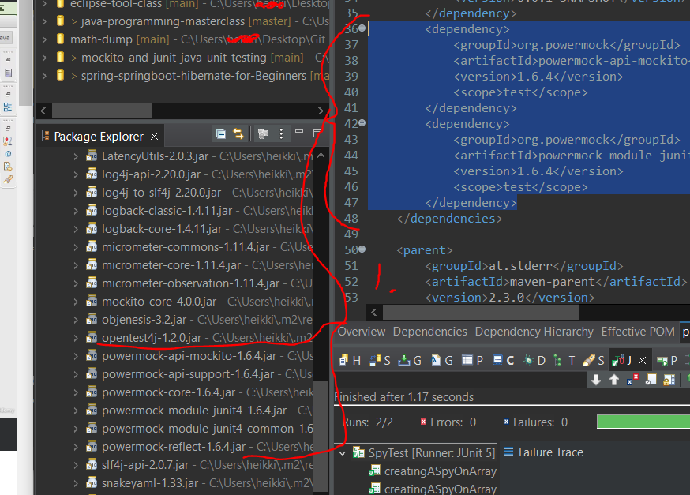

## Section 07 PowerMock with Mockito

PowerMock with Mockito.

# What I Learned

# Step 15 : Setting up PowerMock and SystemUnderTest

- POM for PowerMock.

```
<dependency>
			<groupId>org.powermock</groupId>
			<artifactId>powermock-api-mockito</artifactId>
			<version>1.6.4</version>
			<scope>test</scope>
		</dependency>
		<dependency>
			<groupId>org.powermock</groupId>
			<artifactId>powermock-module-junit4</artifactId>
			<version>1.6.4</version>
			<scope>test</scope>
		</dependency>
```



1. As you can see, even thought POM has 2 dependencies, more than one library gets pulled, since those libraries has decencies also.

- To use PowerMock we need initialize this class with following.

```

@RunWith(PowerMockRunner.class)
@PrepareForTest({ UtilityClass.class})
public class PowerMockitoMockingStaticMethodTest {
 code here ...
}

```

- In where the static method lies  `@PrepareForTest({ UtilityClass.class})`.

- To mock static method, we do following.

```
		PowerMockito.mockStatic(UtilityClass.class);//Get it powermock prepared
		when(UtilityClass.staticMethod(anyLong())).thenReturn(150);
```

- In PowerMock, to verify that method was called, we use following.

```

PowerMockito.verifyStatic(); //Get PowerMock ready for checking
UtilityClass.staticMethod(1 + 2 + 3);

```

- Full test code below.

```
@RunWith(PowerMockRunner.class)
@PrepareForTest({ UtilityClass.class})
public class PowerMockitoMockingStaticMethodTest {

	@Mock
	Dependency dependencyMock;

	@InjectMocks
	SystemUnderTest systemUnderTest;

	@Test
	public void powerMockito_MockingAStaticMethodCall() {

		when(dependencyMock.retrieveAllStats()).thenReturn(
				Arrays.asList(1, 2, 3));

		PowerMockito.mockStatic(UtilityClass.class); //Get it powermock prepared

		when(UtilityClass.staticMethod(anyLong())).thenReturn(150);

		assertEquals(150, systemUnderTest.methodCallingAStaticMethod());

		//To verify a specific method call
		//First : Call PowerMockito.verifyStatic() 
		//Second : Call the method to be verified
		PowerMockito.verifyStatic();
		UtilityClass.staticMethod(1 + 2 + 3);

		// verify exact number of calls
		//PowerMockito.verifyStatic(Mockito.times(1));

	}
}
```

> Lot of things needs to be setup to use PowerMock!

# Step 16 : Invoking Private Methods

- Example if there is no time to refactor, but we wan't to test private method, then you could mock private methods.

- Example mocking **private mock** with PowerMock.

```
	@Test
	public void powerMockito_CallingAPrivateMethod() throws Exception {
		when(dependencyMock.retrieveAllStats()).thenReturn(
				Arrays.asList(1, 2, 3));
		long value = (Long) Whitebox.invokeMethod(systemUnderTest,
				"privateMethodUnderTest");
		assertEquals(6, value);
	}
```

# Step 17 : Mocking a Constructor

- When overriding **constructor** with **PowerMock**, in this case we need provide class for prepare it.

```
@RunWith(PowerMockRunner.class)
@PrepareForTest({ SystemUnderTest.class /*To be able to mock the Constructor, we need to add in the Class that creates the new object*/})
```

- Mocking constructor example.

```
@RunWith(PowerMockRunner.class)
@PrepareForTest({ SystemUnderTest.class /*To be able to mock the Constructor, we need to add in the Class that creates the new object*/})
public class PowerMockitoMockingConstructorTest {

	private static final int SOME_DUMMY_SIZE = 100;

	@Mock
	Dependency dependencyMock;

	@InjectMocks
	SystemUnderTest systemUnderTest;

	@Test
	public void powerMockito_MockingAConstructor() throws Exception {

		ArrayList<String> mockList = mock(ArrayList.class);

		when(mockList.size()).thenReturn(SOME_DUMMY_SIZE);

		PowerMockito.whenNew(ArrayList.class).withAnyArguments().thenReturn(
				mockList);

		int size = systemUnderTest.methodUsingAnArrayListConstructor();

		assertEquals(SOME_DUMMY_SIZE, size);
	}
} 
```

- In general if you need mock out **private**, **static** or **constructors** you are doing something what you should not do! **Avoid doing this!**. Only if you are inside legacy code or something like this, then its more or less ok.

# Step 18 : Writing Good Unit Tests

1. Readability. Naming should be example: **nameOfMethod** + **nameOfScenario**.
	- Test should be contain only what is being tested. Example, Think of **product**, it can have many fields, but what we are concerned about in the test is prize. So we are only constructing **product** with prize. 
	- BDD format. **Given When Then**

2. Test should **fail** when there is real problem.

- Extra resources, but these two points are good points to start!.

[First Principle](https://pragprog.com/magazines/2012-01/unit-tests-are-first)
[XUnitPatterns](http://xunitpatterns.com)
[GoodTest](https://github.com/mockito/mockito/wiki/How-to-write-good-tests)
