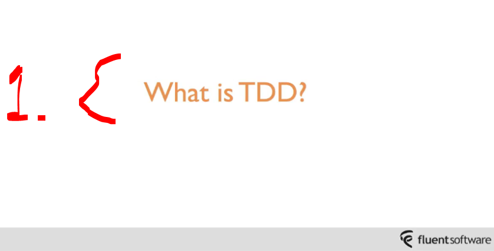
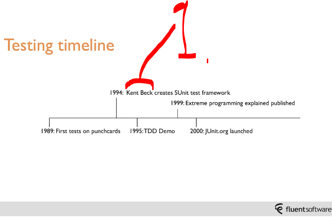
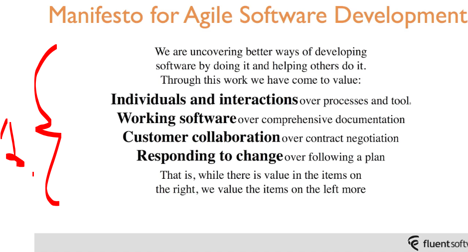
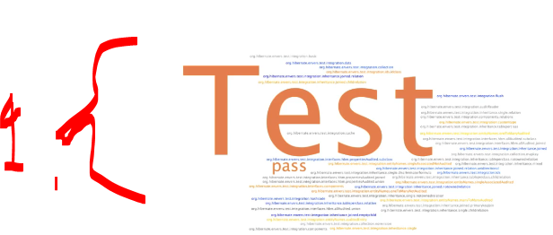
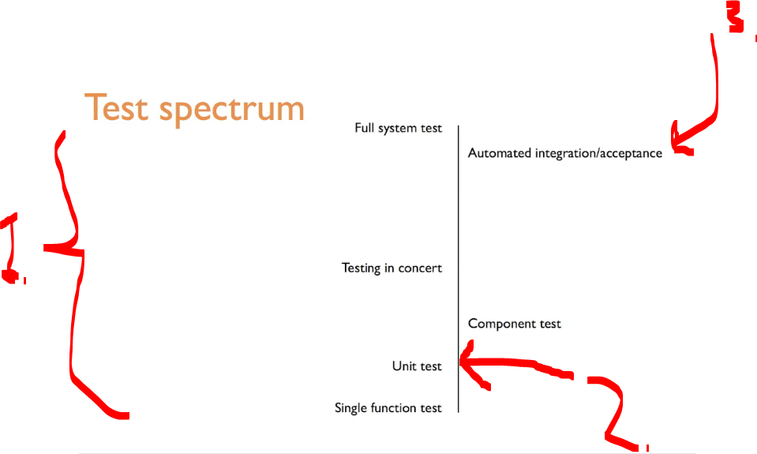
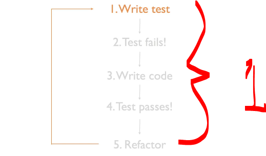
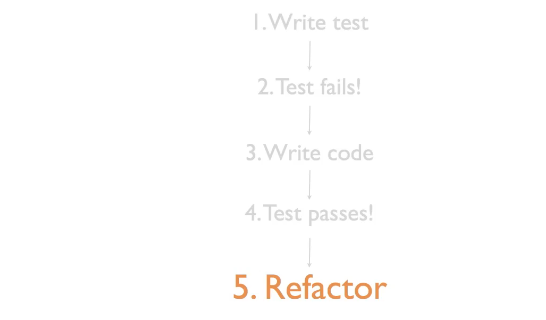

# Section 01: Introduction to TDD.

Introduction to TDD.

# What I Learned.

# What is TDD.

    

1. What is TDD.
    - It's about rapid feedback!
        - Rather **test's** after application code!

    

1. **TDD** was made **popular** by guy called **Kent Beck**!

    

1. Test process can be started from manifesto.

    

1. Making tests in **TDD**, is about just making tests!

    

1. The **different tests** can be run for the system!
    - **TDD** we will be crating different kind of test's! 
2. From unit tests.
3. To the **full level** of **integration** of tests!

# The Test Driven Development cycle.

    

1. When writing test, we need to think about requirements.
    - How to ask about the class under test, based on requirements.
2. We have test, we need to make it fail!
    - We get **more secure**, since we know it fails!
3. We need to write that code that passes!
    - Just make it pass, not too far way!
4. We are looking to pass the test!
5. Last step is, to check if there are **replications**.
    - We are making small increment refactoring changes!

    

1. When ever there is system change, we need to repeat these steps.

# Why TDD?

    

