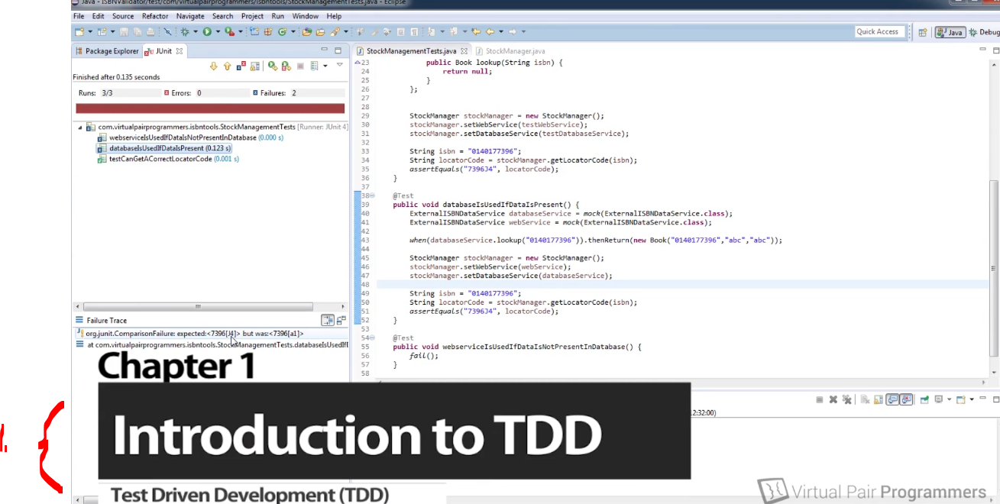
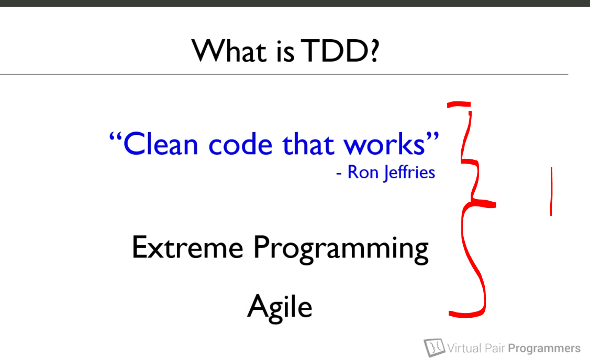
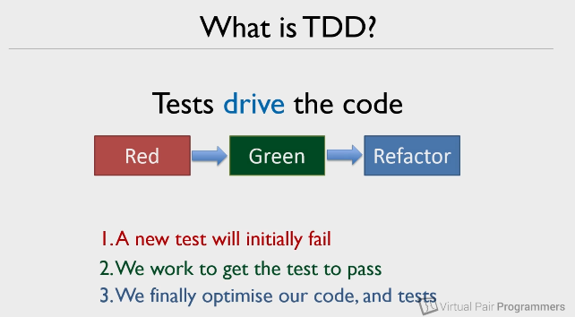
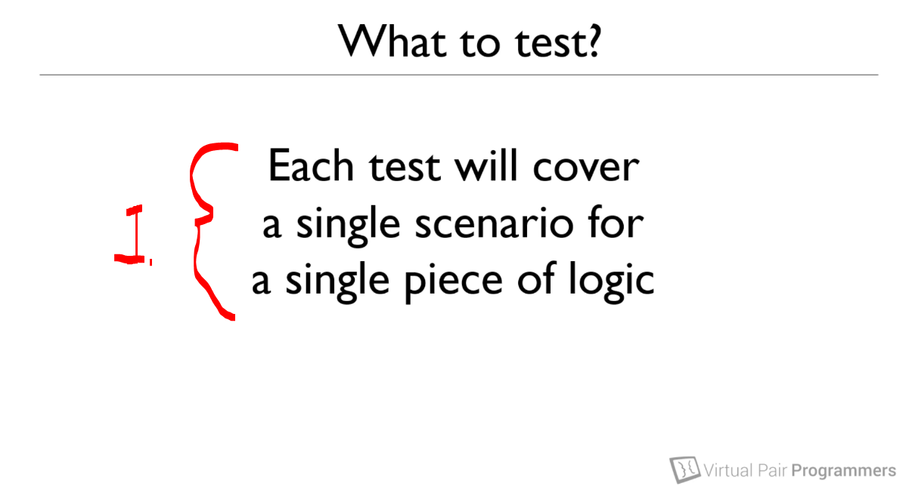

# Section 01: Applying TDD. 

Applying TDD.

# What I Learned.

# Introducing TDD.

    

1. We will be going thought **T**est **D**riven **D**evelopment.

    

1. **TDD** comes from **Extreme Programming**!
    - We are often to enhance the code, where the **TDD** haven't being used.
    - This course is about making **TDD** practical way!

    

-  We use **test** to drive our writing our code!

1. **Red** color means that **tests** they will be failing.
    - This is since they haven't implemented the business logic code!
        - We have only made tests.
2. **Green** color means that, we will write the code to the test to **pass**.
3. **Blue** color means that, we will be **refactoring** our **code** and **test** to make them faster/better!

# What will we test.

    

1. **Notice**, that the writing **feature** can be iterative **process**, since we need test for them!

    

1. We will be writing **Junit**'s, not the **end to end point** test. 
 
# How to get support while you're taking this course.

- Ask questions!