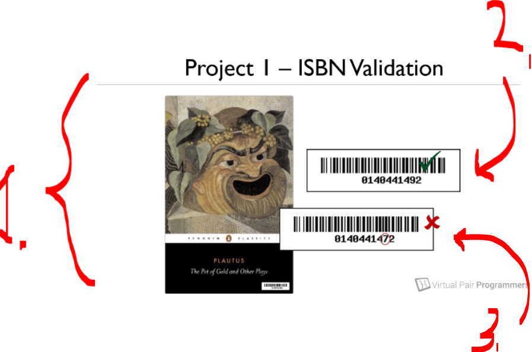

# Section 02: Applying TDD. 

Applying TDD.

# What I Learned

# Introducing our first example project.

<p align="center">
    
</p>

1. We will be writing to write **Junit** for our **business logic project**. This will be introduced soon!

<p align="center">
    
</p>

1. We are making test for **ISBN** system.
    - This stands for **I**nternational **S**tandard **B**ook **N**umber.
2. Final digit is **check number**. For this first case this is valid number!
3. We will change `9` to `7`, this will be invalid **ISBN** number!

# Using the IntelliJ IDE.

- We will be creating the base project here, as below.

- The logic class:

````Java
package org.java.se;

public class ValidateISBN {
    
    ... code goes here 
}

````
- The test class:

````Java
package org.java.se;

import static org.junit.jupiter.api.Assertions.*;

import org.junit.jupiter.api.Test;

class ValidateISBNTest {

... code goes here

}

````

# Creating a project structure for test cases.

- We just set up the project!

# JUnit Basics.

- We will be using **Junit**, from [JUnit Jupiter (Aggregator)](https://mvnrepository.com/artifact/org.junit.jupiter/junit-jupiter/6.0.3).

````Xml
<!-- Source: https://mvnrepository.com/artifact/org.junit.jupiter/junit-jupiter -->
<dependency>
    <groupId>org.junit.jupiter</groupId>
    <artifactId>junit-jupiter</artifactId>
    <version>6.0.3</version>
    <scope>test</scope>
</dependency>`
````

- Just normal JUnit basics!
