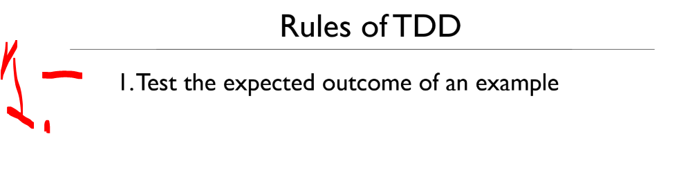
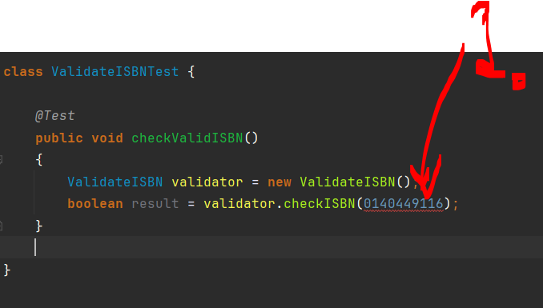
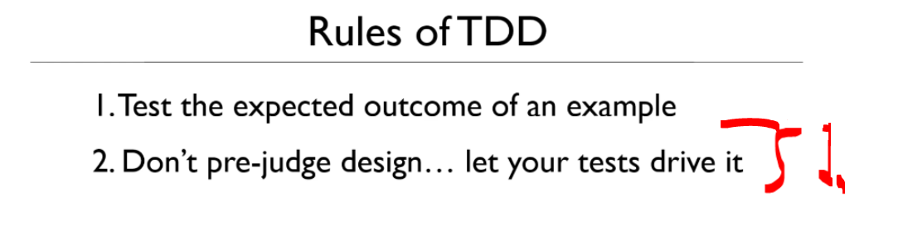
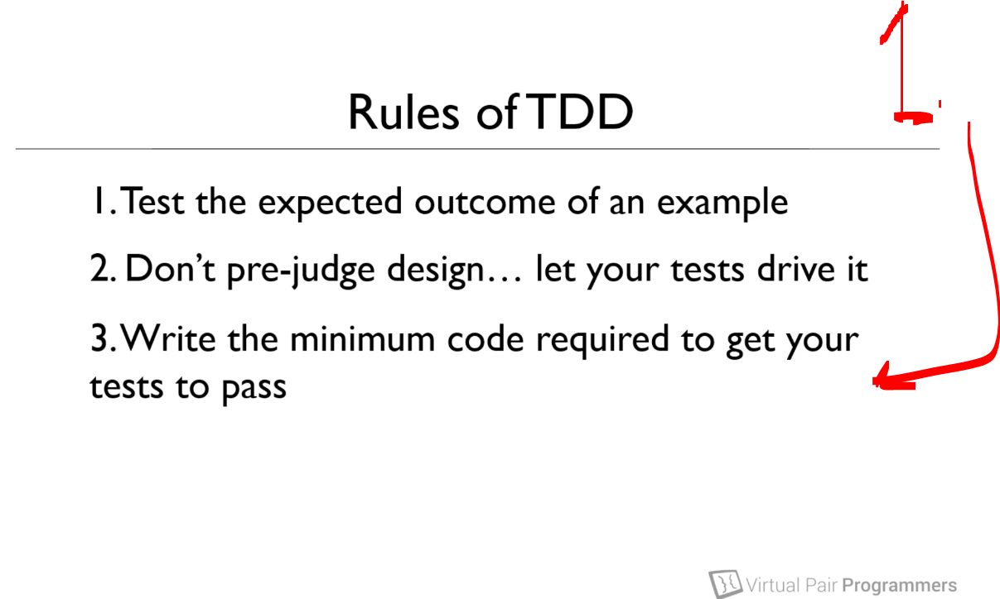

# Section 03: First tests. 

First tests.

# What I Learned.

# Thinking about examples and outcomes.

<p align="center">
    
</p>

1. We will be writing our **first tests**, before code!

- ISBN can be 10 digits and 13 digits long. This can be seen from [ISBN](https://en.wikipedia.org/wiki/ISBN).

- We are looking the [example](https://www.amazon.com/Odyssey-Penguin-Classics-Homer/dp/0140449116).

<p align="center">
    
</p>

1. One can see the **ISBN-13 number** and **ISBN-10 number**.
    - `ISBN-10: 0140449116`.
    - `ISBN-13: 978-0140449112`.

- Why we would choose this test case, when writing test?

<p align="center">
    
</p>

1. When we write **test**, we expect certain outcome! Not architecture, logic etc.
    - Think about outcome, not how it should work in detail!
        - Our case is that is this valid ISBN?

# Step 1 - getting to red.

- We will start from the `checkValidISBN()`.
    - Remember this test needs to fail at **first!**

````Java
    @Test
	public void checkValidISBN()
	{
		fail();
	}
````

> [!IMPORTANT]
> Always start with **failing test**, in **TDD**!

- Remember we will follow, the **TDD pattern**:
    - Red.
    - Green.
    - Refactor.

- Next, we will be writing **test's** that satisfies the **green** status, meaning passes! As following code:

````Java
class ValidateISBNTest {

	@Test
	public void checkValidISBN()
	{
		ValidateISBN validator = new ValidateISBN();
		boolean result = validator.checkISBN(0140449116);
	}
	
}
````

- This brings another side of **TDD** on the picture.

<p align="center">
    
</p>

1. We should be adding **valid** ISBN, but as `integer`. There is **error**, but we don't need to think to be perfect, we just want it to be able to compile!
    - We don't care, if this is **right** or **not**, for now integer can be fine for now!

<p align="center">
    
</p>

1. We don't know does our value need to be **string** or **integer**, but we don't judge. Furthermore, we look at the **data** and see it looks like its **integer**, and we **go with it**!

- After this we will have the following code, to satisfy the failing red test criteria!

````Java
package org.java.se;

import static org.junit.jupiter.api.Assertions.*;

import org.junit.jupiter.api.Test;

class ValidateISBNTest {

	@Test
	public void checkValidISBN()
	{
		ValidateISBN validator = new ValidateISBN();
		boolean result = validator.checkISBN(140449116);

		assertTrue(result);
	}
}
````

- And the test:

````Java
public class ValidateISBN {

	public boolean checkISBN(int isbn) {
		return false;
	}
````

<p align="center">
    
</p>

1. We get successful case as first part of the **TDD**, the status **red**.¨

# Step 2 - getting to green.

- Now we need to think, how to make our test **green**!

<p align="center">
    
</p>

1. In this step, we want to make our **test pass**! Even if it feels wrong in long run, we just want to make this test pass!
    - Below code makes the test pass, but the implementation is wrong!

````Java
public class ValidateISBN {
	public boolean checkISBN(int isbn) {
		return true;
	}
````

# Why you must always start with a failing test!

# Adding more tests.

# Finally writing some code.