# Section 03: First tests. 

First tests.

# What I Learned.

# Thinking about examples and outcomes.

<p align="center">
    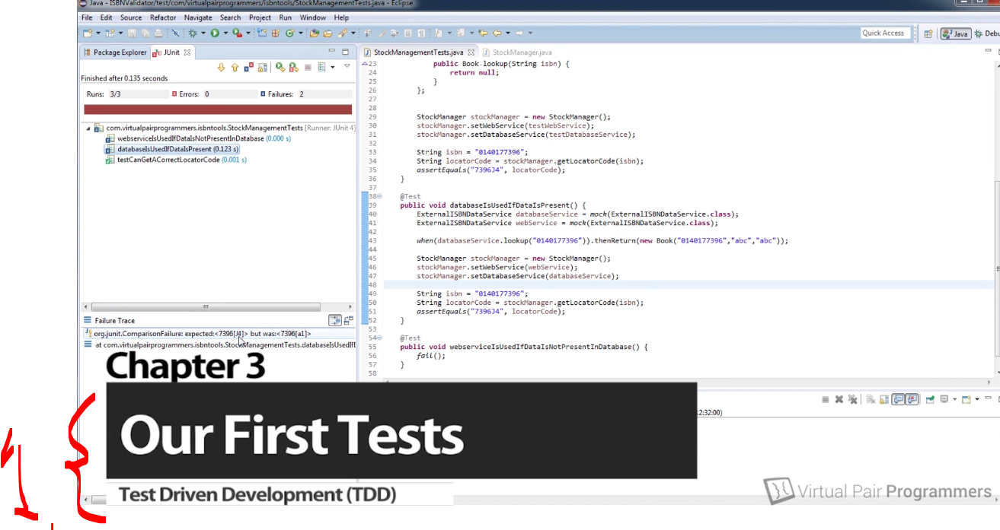
</p>

1. We will be writing our **first tests**, before code!

- ISBN can be 10 digits and 13 digits long. This can be seen from [ISBN](https://en.wikipedia.org/wiki/ISBN).

- We are looking the [example](https://www.amazon.com/Odyssey-Penguin-Classics-Homer/dp/0140449116).

<p align="center">
    
</p>

1. One can see the **ISBN-13 number** and **ISBN-10 number**.
    - `ISBN-10: 0140449116`.
    - `ISBN-13: 978-0140449112`.

- Why we would choose this test case, when writing test?

<p align="center">
    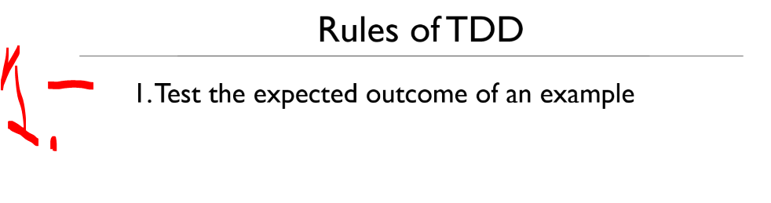
</p>

1. When we write **test**, we expect certain outcome! Not considering architecture, logic etc.
    - Think about **outcome**, not how it should work in detail!
        - Our case, *that is this valid ISBN?*

# Step 1 - getting to red.

- We will start from the `checkValidISBN()`.
    - Remember this test needs to fail at **first!**

````Java
    @Test
	public void checkValidISBN()
	{
		fail();
	}
````

- As you can see the failed test:

<p align="center">
    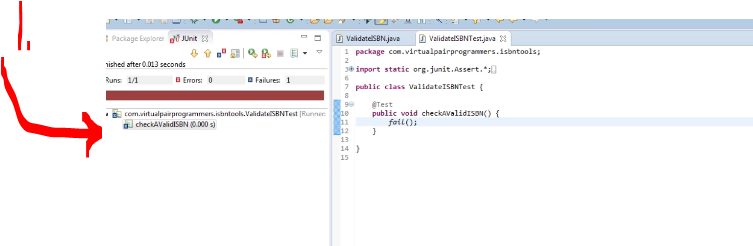
</p>

1. First we will get failing test!

> [!IMPORTANT]
> Always start with **failing test**, in **TDD**!

- Remember we will follow, the **TDD pattern**:
    - Red.
    - Green.
    - Refactor.

- Next, we will be writing **test's** that satisfies the **green** status, meaning passes, as following code:

````Java
class ValidateISBNTest {

	@Test
	public void checkValidISBN()
	{
		ValidateISBN validator = new ValidateISBN();
		boolean result = validator.checkISBN(0140449116);
	}
	
}
````

- This brings another side of problem **TDD** on the picture.

<p align="center">
    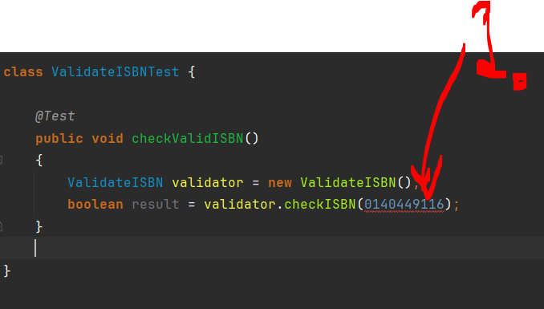
</p>

1. We should be adding **valid** *ISBN*, but as `integer`. There is **error**, but we don't need to think to be perfect, we just want it to be able to compile!
    - We don't care, if this is **right** or **not**, for now `integer` can be fine for now!

<p align="center">
    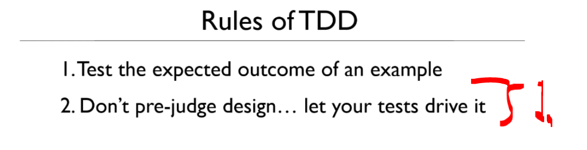
</p>

1. We don't know what does our **value** needs to be `string` or `integer`, but we don't judge. Furthermore, we look at the **data** and see it looks like its `integer`, and we **go with it**!

- After this we will have the following code, to satisfy the failing red test criteria!

````Java
package org.java.se;

import static org.junit.jupiter.api.Assertions.*;

import org.junit.jupiter.api.Test;

class ValidateISBNTest {

	@Test
	public void checkValidISBN()
	{
		ValidateISBN validator = new ValidateISBN();
		boolean result = validator.checkISBN(140449116);

		assertTrue(result);
	}
}
````

- And the test:

````Java
public class ValidateISBN {

	public boolean checkISBN(int isbn) {
		return false;
	}
````

<p align="center">
    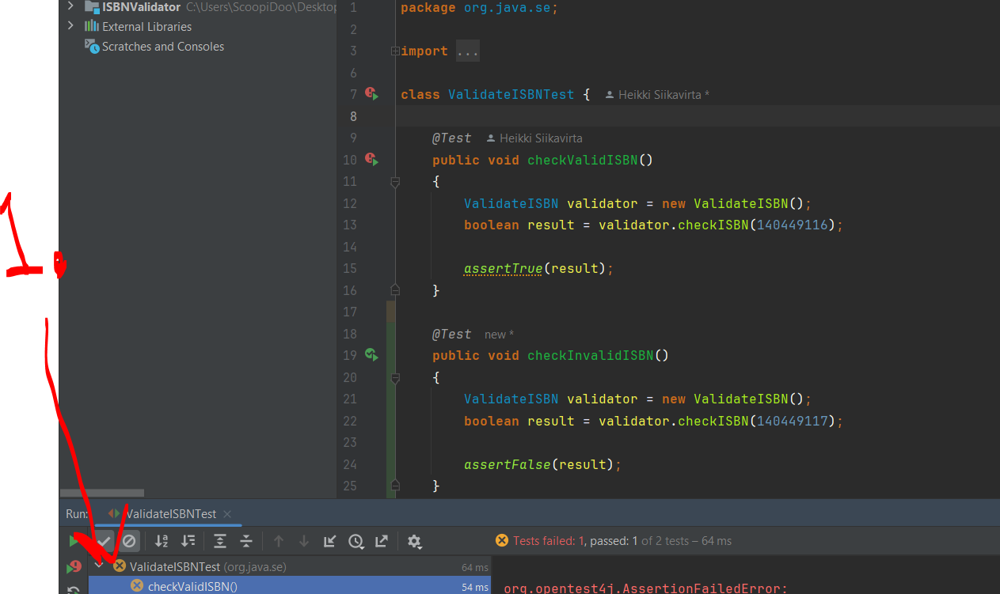
</p>

1. We get successful case as first part of the **TDD**, the status **red**.

# Step 2 - getting to green.

- Now we need to think, how to make our test **green**!

<p align="center">
    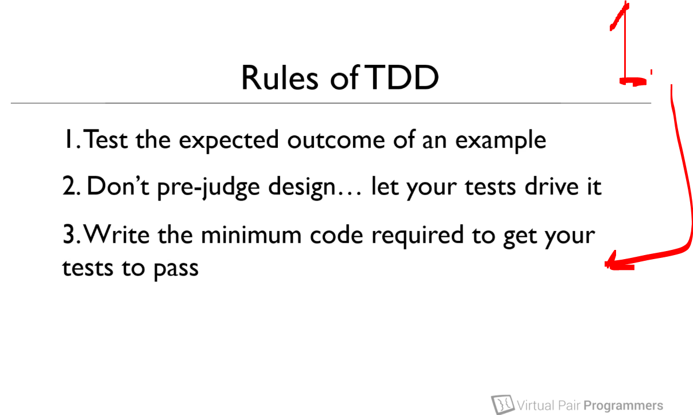
</p>

1. In this step, we want to make our **test pass**! Even if it feels wrong in long run, we just want to make this test pass!
    - Below code makes the test pass, but the implementation is wrong!

````Java
public class ValidateISBN {
	public boolean checkISBN(int isbn) {
		return true;
	}
````

- Code making this code pass! Yes, it's illogical in long run!

<p align="center">
    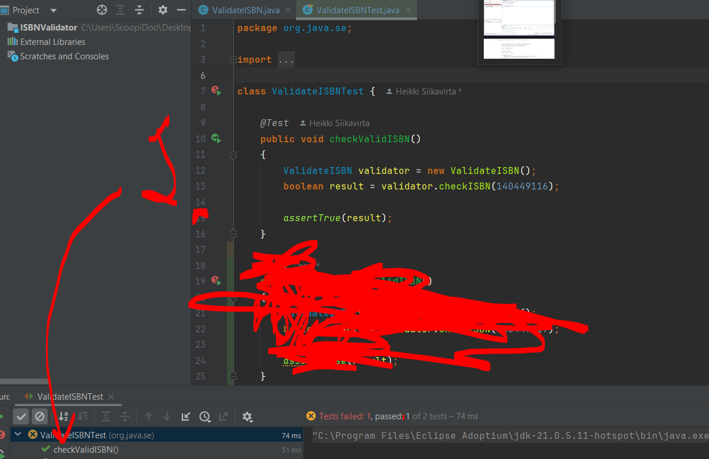
</p>

1. Now we get this test working as **green**.

- Next step is the **refactoring**, but there is nothing to do in this round of evaluation!

# Why you must always start with a failing test!

- Let's make second test.
	- This will be failing test!

````Java
	@Test
	public void checkInvalidISBN()
	{
		ValidateISBN validator = new ValidateISBN();
		boolean result = validator.checkISBN(140449117);

		assertFalse(result);
	}
````

- And we try to get **failing test**!

<p align="center">
    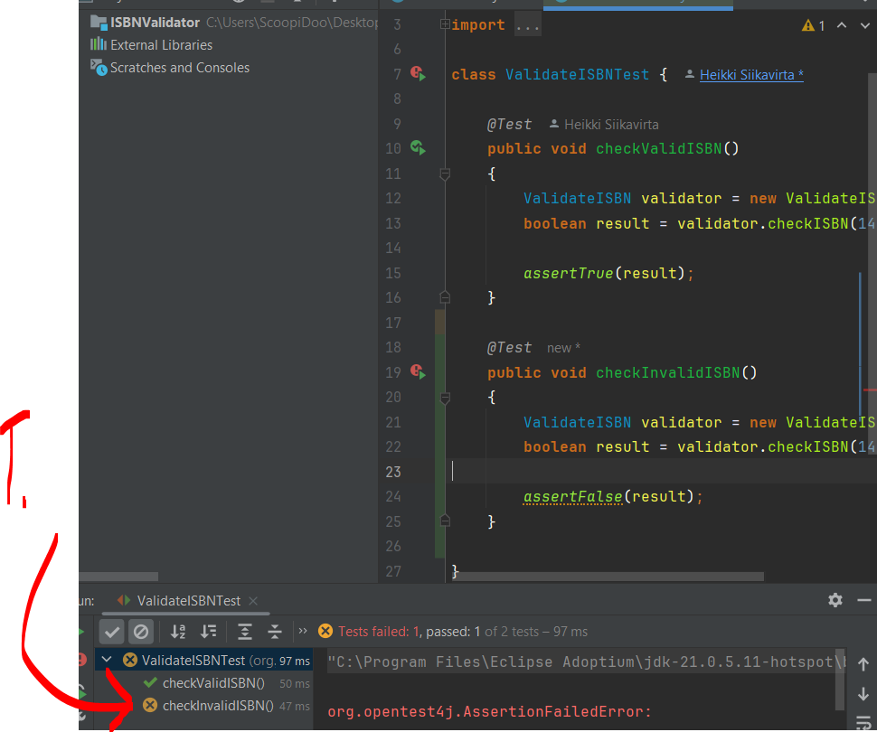
</p>

1. **Failing test** in first test!

- Then make this **green**:

````Java
	public boolean checkISBN(int isbn) {

		if (isbn == 140449116)
		{
			return true;
		}
		return false;
	}
````

<p align="center">
    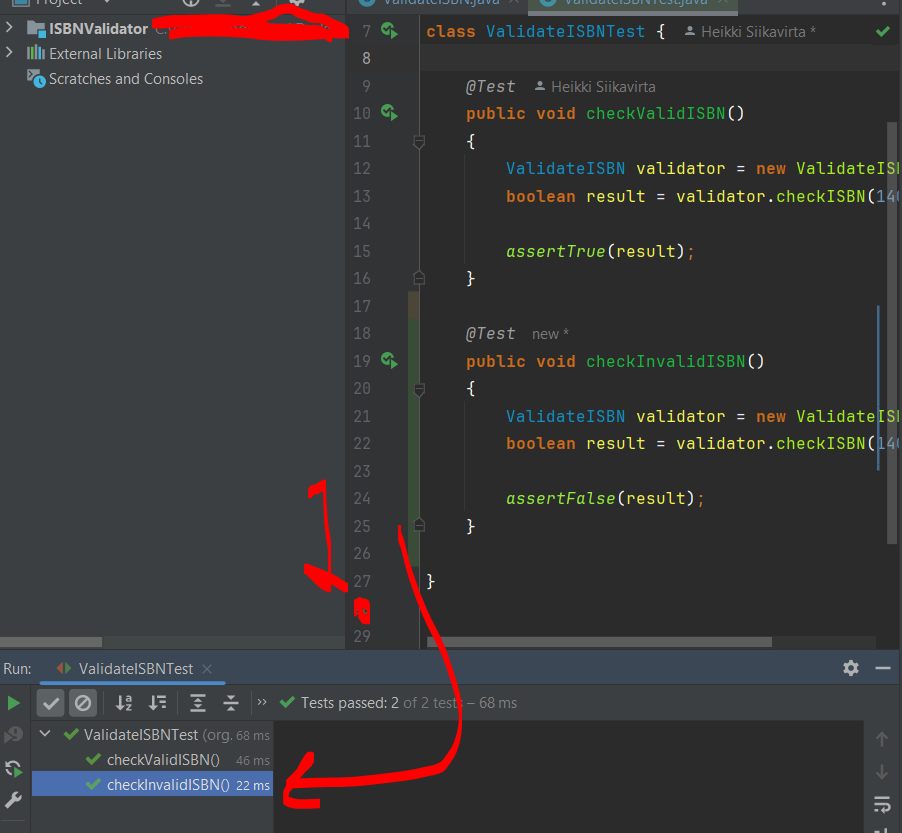
</p>

1. We get **pass** for the invalid case!

# Adding more tests.

- First we will use another book from [Of Mice and Men](https://www.amazon.com/Mice-Men-John-Steinbeck/dp/0140177396).

<p align="center">
    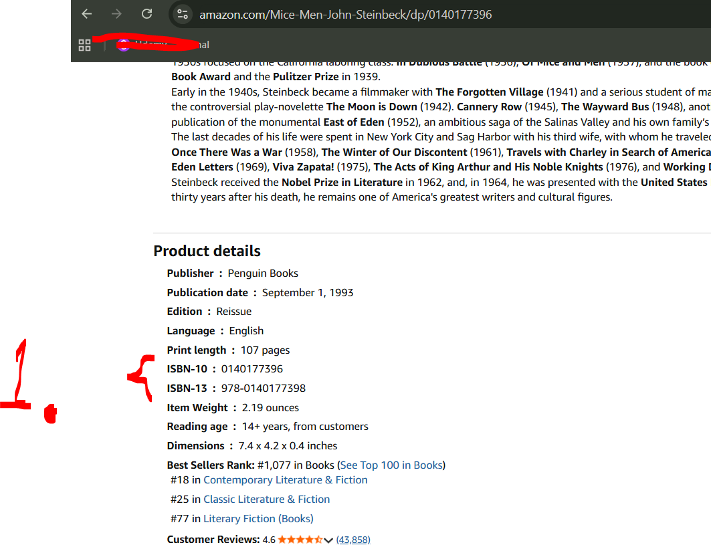
</p>

1. The second example **ISBN-13 number** and **ISBN-10 number**.
	- **ISBN-10** `0140177396`.
	- **ISBN-13** `978-978`.

- Now, should we make this **second** book individual test, or merge on the previous one!

<p align="center">
    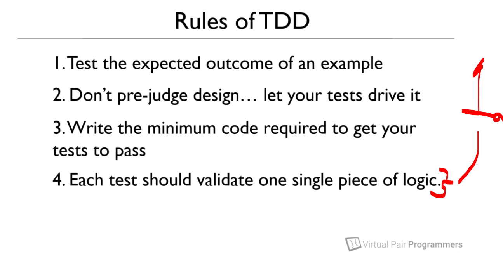
</p>

1. One test of one piece of logic.
	- If we have method, which accepts multiple arguments.
		- We can test those cases individually, writing case by case cases!
	- **Different values** for the same logic to be tested, this should be inside **one** test. Like in our case, two *ISBN*s!

- We **include** the test to the **previous** test case `checkValidISBN()`.

````Java
	@Test
	public void checkValidISBN()
	{
		// First case!
		ValidateISBN validator = new ValidateISBN();
		boolean result = validator.checkISBN(140449116);
		assertTrue( result, "First value:");
		// Second case!
		result = validator.checkISBN(140177396);
		assertTrue(result, "Second value:");
	}
````

- First we are looking for the failing test.

<p align="center">
    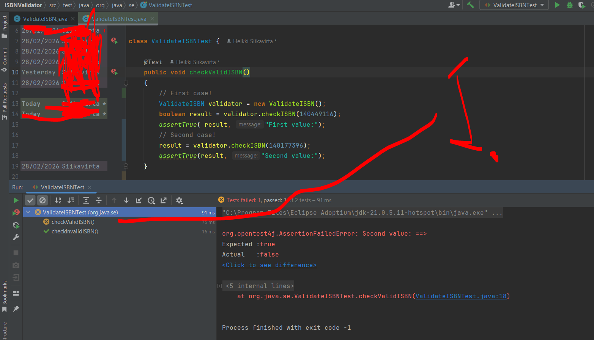
</p>

1. We get **fail** for the invalid case! This is due to the failing logic.

- Now, we will be writing this code to **green**, with real logic. The logic can be found [here](https://en.wikipedia.org/wiki/ISBN).

# Finally writing some code.

- We will be implementing following formula, for the *ISBN-10* digit **validation**:

<p align="center">
    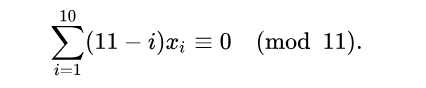
</p>

<p align="center">
    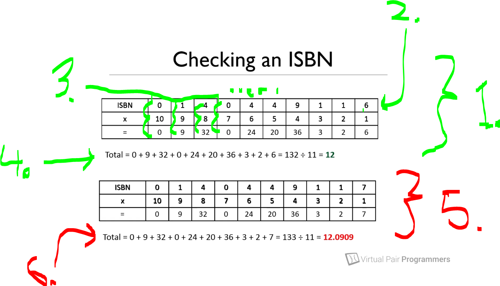
</p>

1. We are **validating** the **correct** *ISBN* number!
2. Here we have the **valid** *ISBN*:
3. The validation logic goes as such:
	- First: `0 x 10 = 0`.
	- Second: `1 x 9 = 9`.
	- Third: `4 x 8 = 32`.
	- Fourth: `0 x 7 = 0`.
	- And so on ...
 4. We add those together and then divide by the `11`, that makes the **validation number**!
	- Since this is **exact number**, this is valid *ISBN* number!
5. We are **validating** the **incorrect** *ISBN* number!
	- In this case, the result is **non-exact** number, meaning this is not valid case!

- First we need to check that the *ISBN* is ten digits long.
	- Meaning, this number is needing to a `string`.

````Java
	public boolean checkISBN(String isbn) {
		if (isbn == "0140449116") {
			return true;
		}
		return false;
	}
````

- We will be having the `string` change:

<p align="center">
    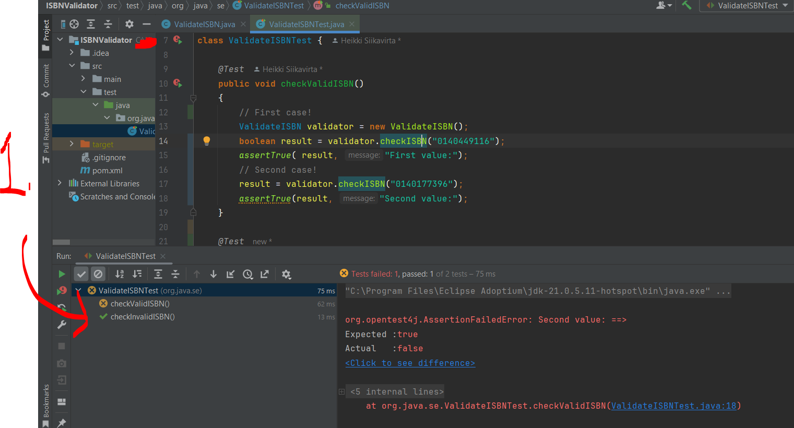
</p>

1. We are testing the change, that the tests will be pass.

- Furthermore, we will be having code logic for the validation:

<p align="center">
    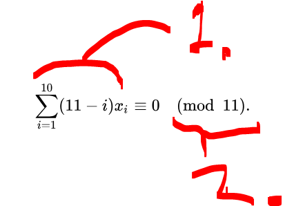
</p>

1. We will be implementing following **sum** logic:

````Java
		// The adding of the numbers together, sum.
		for (int i = 0; i < 10; i++)
		{
			total += isbn.charAt(i) * (10 - i);
		}
````

2. The checking of the **modulo** operator with **11**.

````Java
		if (total % 11 == 0)
		{
			return true;
		}
		else{
			return false;
		}
````

- We are implementing the validation changes, for simple passes!

````Java
	public boolean checkISBN(String isbn) {
		int total = 0;
		// The adding of the numbers together, sum.
		for (int i = 0; i < 10; i++)
		{
			total += isbn.charAt(i) * (10 - i);
		}
		//  The modules operation
		if (total % 11 == 0)
		{
			return true;
		}
		else{
			return false;
		}
	}
````

<p align="center">
    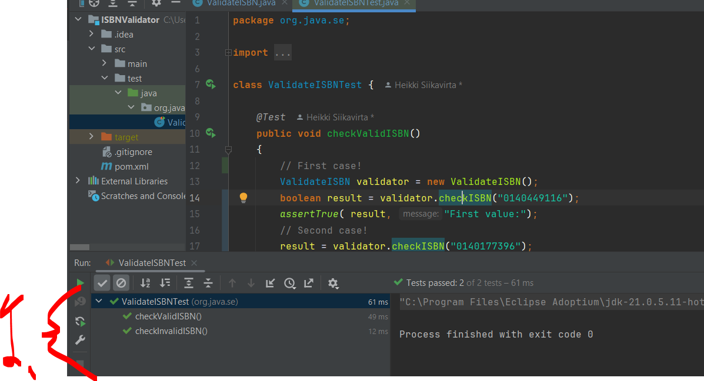
</p>

1. First version of the validation logic passed!