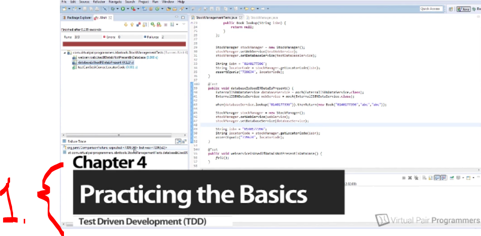
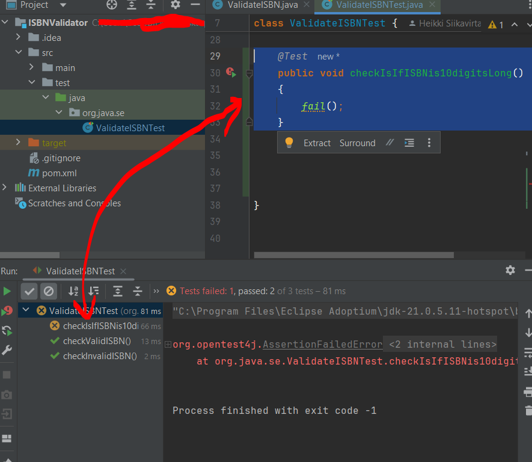
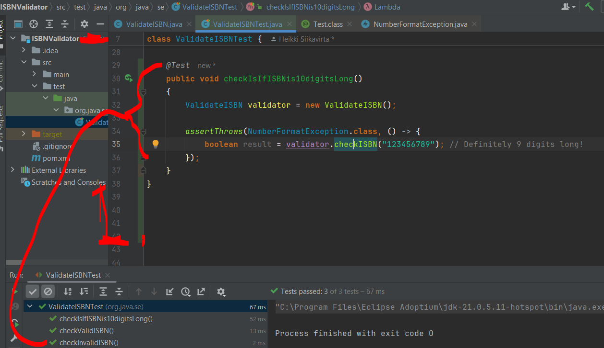
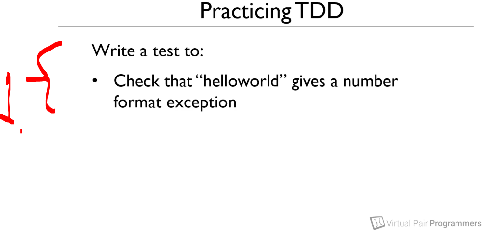
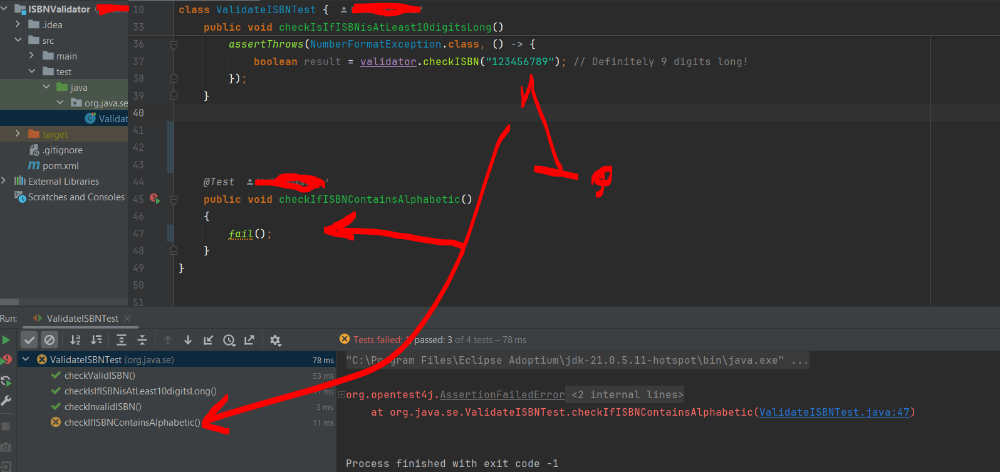
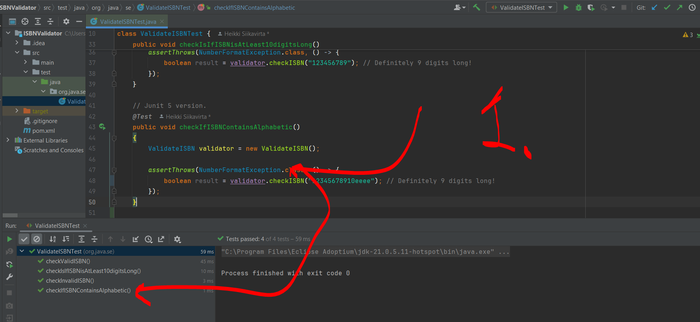

# Section 04: Practicing the basics. 

Practicing the basics.

# What I Learned.

# Testing for exceptions - and challenge number 01.

<p align="center">
    
</p>

1. In this chapter, we will be going thought the making *ISBN* validator better!
    - This will be doing **exception** testing! 

- First scenario is to write that *ISBN* needs to be **at least** 10 digits long!

- First we will be writing failing test.

````Java 
	@Test
	public void checkIsIfISBNis10digitsLong()
	{
		fail();
	}

````

<p align="center">
    
</p>

1. We get the failing test!

- We have **two** ways to **throw** exception (JUnit 5 way):
    - The **old** way, which should **not** be used!
    
    ````Java
    @Test
    public void testException() {
        try {
            service.process(null);
            fail("Exception expected");
        } catch (IllegalArgumentException e) {
            assertEquals("Input cannot be null", e.getMessage());
        }
    }
    ````

    - Or capturing the exception!

    ````Java
        @Test
        void testExceptionMessage() {
        IllegalArgumentException ex =
            assertThrows(IllegalArgumentException.class,
                        () -> service.process(null));
            assertEquals("Input cannot be null", ex.getMessage());
        }    
    ````
    - Or just asserting the exception!
    ```Java
        @Test
        void testException() {
            assertThrows(IllegalArgumentException.class, () -> {
                service.process(null);
            });
        }
    ````

- We are going to use the `NumberFormatException.class`
    ````Yml
    Thrown to indicate that the application has attempted to convert a string to one of the numeric types, but that the string does not have the appropriate format.
    ````

- Our current test:

    ````
        @Test
        public void checkIsIfISBNisAtLeast10digitsLong()
        {
            ValidateISBN validator = new ValidateISBN();
            assertThrows(NumberFormatException.class, () -> {
                boolean result = validator.checkISBN("123456789"); // Definitely 9 digits long!
            });
        }
    ````

- And The `ValidateISBN.java` for this:

    ````Java
        public boolean checkISBN(String isbn) {

            if (isbn == null | isbn.length() < 10)
            {
                throw new NumberFormatException();
            }

            int total = 0;
            // The adding of the numbers together, sum.
            for (int i = 0; i < 10; i++)
            {
                total += isbn.charAt(i) * (10 - i);
            }

            //  The modules operation
            if (total % 11 == 0)
            {
                return true;
            }
            else{
                return false;
            }

        }
    ````

- We can see **green** bar.

<p align="center">
    
</p>

1. Green bar!

- Last step is **refactoring** step, there is no need for refactor!

<p align="center">
    
</p>

1. We will be making test for following, this needs give `Format Exception` when `string` is inputted! In next chapter.

# Challenge 02 - writing a test.

- My example, first we make test **fail**:

````Java
    @Test
	public void checkIfISBNContainsAlphabetic()
	{
		fail();
	}
````

- We get by running it.

<p align="center">
    
</p>

1. We get **failing** test. 

- My version for checking, if there is any **alphabet** in the **strings**:

````Java
    public static boolean isAlphabet(String str) {
        return str.matches("[a-zA-Z]+");
    }
````

- And The `ValidateISBN.java` for this:

````Java

	public boolean checkISBN(String isbn) {

		if (isbn == null | isbn.length() < 10)
		{
			throw new NumberFormatException();
		}

		int total = 0;
		// The adding of the numbers together, sum.
		for (int i = 0; i < 10; i++)
		{
			if (containsAlphabet(isbn))
			{
				throw new NumberFormatException("ISBN numbers does not contain alphabet's!");
			}

			total += isbn.charAt(i) * (10 - i);
		}

		//  The modules operation
		if (total % 11 == 0)
		{
			return true;
		}
		else{
			return false;
		}

	}
````

- My Test:

````
	@Test
	public void checkIfISBNContainsAlphabetic()
	{
		ValidateISBN validator = new ValidateISBN();

		assertThrows(NumberFormatException.class, () -> {
			boolean result = validator.checkISBN("12345678910eeee"); // Definitely 9 digits long!
		});
	}
````

- We can see **green** bar.

<p align="center">
    
</p>

1. We get **green** test.

# Getting to more complex requirements and finding hidden requirements.

- We are having *ISBN*, which has **alphabets**.

# Challenge 03 - Adding further business requirements.