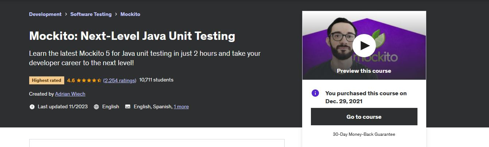

    

    Attempt to study <b>test or testing related</b> topics!
    

    

- For these courses one should configure **GIT** for handle projects.
    - `git config --global http.postBuffer 524288000`.
    - `git config --global core.longpaths true`.

    

    

All course material from *Mockito: Next-Level Java Unit Testing* by **Adrian Więch**.
>One afternoon, during a release crunch, the problem escalated. A critical module needed **unit test** coverage before merge approval—but we had only 15 minutes to add the tests so the pipeline could pass and the deployment window wouldn’t be missed.
>   
~ *DevelopersCradle*

Contains my own notes to better learning experience. 

[The Course at Udemy](https://www.udemy.com/course/mockito3/).   

If the content sparked :fire: your interest, please consider buying the course and start learning :book:

This repository is made with **Eclipse**, therefore it will include configuration files which are related to this IDE this approach will be favored for now. ⚙️

<!-- 
Linkedin puts this shit front, when clicking from private mode x(. Need to put this to make jump working every case
?trk=public_profile_see-credential 
-->

    

**Note: The material provided in this repository is only for helping those who may get stuck at any point of time in the course. It is very advised that no one should just copy the solutions(violation of Honor Code) presented here.**

#### Progress/Curriculum.

- [x] [Section 01](https://github.com/developersCradle/mockito-and-junit-java-unit-testing/tree/main/Mockito%20Next-Level%20Java%20Unit%20Testing/Section%201%20First%20things%20first) - First things first. ✔️
- [x] [Section 02](https://github.com/developersCradle/mockito-and-junit-java-unit-testing/tree/main/Mockito%20Next-Level%20Java%20Unit%20Testing/Section%202%20Mockito%203%20Basics) - Mockito 4 Basics. ✔️
- [x] [Section 03](https://github.com/developersCradle/mockito-and-junit-java-unit-testing/tree/main/Mockito%20Next-Level%20Java%20Unit%20Testing/Section%203%20More%20Advanced%20Concepts) - More Advanced Concepts. ✔️
- [x] [Section 04](https://github.com/developersCradle/mockito-and-junit-java-unit-testing/tree/main/Mockito%20Next-Level%20Java%20Unit%20Testing/Section%204%20Additional%20Videos) - Additional Videos. ✔️
- [x] [Section 05](https://github.com/developersCradle/mockito-and-junit-java-unit-testing/tree/main/Mockito%20Next-Level%20Java%20Unit%20Testing/Section%205%20Want%20to%20Learn%20More) - Want to Learn More? ✔️

#### Additional stuff.

- [ ] Add here

#### The Quizzes and Labs.

* **Section 01**:
    * *Quiz*:
        * [Some here](#).
    * *Coding Exercise*:
        * [Some here](#).

    

    

All course material from *Selenium WebDriver with Java* by **Rahul Shetty**.

>   
~ *DevelopersCradle*

Contains my own notes to better learning experience with some course content. 

[The Course at Udemy](https://www.udemy.com/course/selenium-real-time-examplesinterview-questions/).

[Homepage of Maker](https://rahulshettyacademy.com/).

If the content sparked :fire: your interest, please consider buying the course and start learning :book:

This repository is made with **Eclipse**, therefore it will include configuration files which are related to this IDE this approach will be favored for now. ⚙️

 

<!-- 
Linkedin puts this shit front, when clicking from private mode x(. Need to put this to make jump working every case
?trk=public_profile_see-credential 
-->

    cert here

**Note: The material provided in this repository is only for helping those who may get stuck at any point of time in the course. It is very advised that no one should just copy the solutions(violation of Honor Code) presented here.**

#### Progress/Curriculum.

- [ ] [Section 01](#) - Selenium Introduction.
- [ ] [Section 02](#) - Install Java & Selenium – Get Started with basic Steps of the Selenium WebDriver.
- [ ] [Section 03](#) - Brush up Java Concepts for Selenium Automation.
- [ ] [Section 04](#) - CORE JAVA In depth for Manual testers and Beginners.
- [ ] [Section 05](#) - Locator Techniques & Tools used to identify Objects.
- [ ] [Section 06](#) - Advanced Locators Identification & Interview Questions on Parsing Text.
- [ ] [Section 07](#) - Selenium Webdriver → Techniques to automate Web elements.
- [ ] [Section 08](#) - Deep Dive into Functional testing with Selenium.
- [ ] [Section 09](#) - Synchronization usage in Selenium Webdriver.
- [ ] [Section 10](#) - Techniques to automate Ajax calls, Child Windows and IFrames.
- [ ] [Section 11](#) - Real Time Exercises (end to end Programming).
- [ ] [Section 12](#) - Practical problems and Methods to Handle them with Selenium.
- [ ] [Section 13](#) - Miscellaneous topics in Selenium WebDriver.
- [ ] [Section 14](#) - Selenium Java Streams - Automate Sort, Pagination, Filtering the Web Tables.
- [ ] [Section 15](#) - Selenium 4.0 - Latest Features.
- [ ] [Section 16](#) - Framework Part -1 - TestNG.
- [ ] [Section 17](#) - Learn Java Object Oriented Principles needed for Framework development.
- [ ] [Section 18](#) - Framework Part 1 - Create Maven Project and Prepare Functional End to end Test.
- [ ] [Section 19](#) - Framework Part 2 - Design Pattern - Page Object & factory Implementation.
- [ ] [Section 20](#) - Framework Part 3 - Test Configuration Methods & Global Properties & Parallel Runs.
- [ ] [Section 21](#) - Framework Part 4 - Test Strategy - Control Tests Execution - Run Parallel Tests.

#### Additional stuff.

- [ ] Add here

#### The Quizzes and Labs.

* **Section 01**:
    * *Quiz*:
        * [Some here](#).
    * *Coding Exercise*:
        * [Some here](#).

    

All course material from *Spring Boot Unit Testing with JUnit, Mockito and MockMvc* by **Chad Darby** and **Eric Roby**.

>   
~ *DevelopersCradle*

Contains my own notes to better learning experience.

[The Course at Udemy](https://www.udemy.com/course/spring-boot-unit-testing/).   

[Homepage of Maker 1](https://linkedin.com/in/codingwithroby).

[Homepage of Maker 2](https://luv2code.com/).

If the content sparked :fire: your interest, please consider buying the course and start learning :book:

This repository is made with **Eclipse**, therefore it will include configuration files which are related to this IDE this approach will be favored for now. ⚙️

<!-- 
Linkedin puts this shit front, when clicking from private mode x(. Need to put this to make jump working every case
?trk=public_profile_see-credential 
-->

    add here

**Note: The material provided in this repository is only for helping those who may get stuck at any point of time in the course. It is very advised that no one should just copy the solutions(violation of Honor Code) presented here.**

#### Progress/Curriculum.

- [ ] [Section 01](#) - Introduction.
- [ ] [Section 02](#) - JUnit Review.
- [ ] [Section 03](#) - Test Driven Development (TDD).
- [ ] [Section 04](#) - Spring Boot Unit Testing Support.
- [ ] [Section 05](#) - Unit Testing - Mocking with Mockito.
- [ ] [Section 06](#) - Unit Testing - Reflection Test Utils.
- [ ] [Section 07](#) - Testing Spring Boot MVC Web Apps - Database Integration Testing.
- [ ] [Section 08](#) - Testing Spring Boot MVC Web Apps - MVC Controller Testing.
- [ ] [Section 09](#) - Testing Spring Boot MVC Web Apps - GradeBook App - Student Grades.
- [ ] [Section 10](#) - Testing Spring Boot MVC Web Apps - Set Up SQL Scripts in properties file.
- [ ] [Section 11](#) - Testing Spring Boot MVC Web Apps - Student Information and Grades.
- [ ] [Section 12](#) - Testing Spring Boot REST APIs.
- [ ] [Section 13](#) - Summary.
- [ ] [Section 14](#) - Appendix
- [ ] [Section 15](#) - Bonus.

#### Additional stuff.

- [ ] Add here

#### The Quizzes and Labs.

* **Section 01**:
    * *Quiz*:
        * [Some here](#).
    * *Coding Exercise*:
        * [Some here](#).

    

    

All course material from *Selenium WebDriver with Java* by **Rahul Shetty**.

>   
~ *DevelopersCradle*

Contains my own notes to better learning experience with some course content. 

[The Course at Udemy](https://www.udemy.com/course/cucumber-tutorial/).

[Homepage of Maker](https://rahulshettyacademy.com/).

If the content sparked :fire: your interest, please consider buying the course and start learning :book:

This repository is made with **Eclipse**, therefore it will include configuration files which are related to this IDE this approach will be favored for now. ⚙️

 

<!-- 
Linkedin puts this shit front, when clicking from private mode x(. Need to put this to make jump working every case
?trk=public_profile_see-credential 
-->

    cert here

**Note: The material provided in this repository is only for helping those who may get stuck at any point of time in the course. It is very advised that no one should just copy the solutions(violation of Honor Code) presented here.**

#### Progress/Curriculum.

- [ ] [Section 01](#) - 

#### Additional stuff.

- [ ] Add here

#### The Quizzes and Labs.

* **Section 01**:
    * *Quiz*:
        * [Some here](#).
    * *Coding Exercise*:
        * [Some here](#).

    

    

All course material from Learn *Java Unit Testing with Junit & Mockito in 30 Steps* by **Ranga Karanam** from legendary **in28minutes**.

>   
~ *DevelopersCradle*

Contains my own notes to better learning experience with some course content. 

[The Course at Udemy](https://www.udemy.com/course/mockito-tutorial-with-junit-examples/).

[Homepage of Maker](https://www.in28minutes.com/).

[Github of project](https://github.com/in28minutes/MockitoTutorialForBeginners).

If the content sparked :fire: your interest, please consider buying the course and start learning :book:

This repository is made with **Eclipse**, therefore it will include configuration files which are related to this IDE this approach will be favored for now. ⚙️

 

<!-- 
Linkedin puts this shit front, when clicking from private mode x(. Need to put this to make jump working every case
?trk=public_profile_see-credential 
-->

    

**Note: The material provided in this repository is only for helping those who may get stuck at any point of time in the course. It is very advised that no one should just copy the solutions(violation of Honor Code) presented here.**

#### Progress/Curriculum.

- [x] [Section 01](https://github.com/developersCradle/mockito-and-junit-java-unit-testing/tree/main/Learn%20Java%20Unit%20Testing%20with%20Junit%20%26%20Mockito%20in%2030%20Steps/Section%2001%20JunitAndMockito) - Introduction. ✔️
- [X] [Section 02](https://github.com/developersCradle/mockito-and-junit-java-unit-testing/tree/main/Learn%20Java%20Unit%20Testing%20with%20Junit%20%26%20Mockito%20in%2030%20Steps/Section%2002%20JunitAndMockito) - Unit Testing with Junit. ✔️
- [x] [Section 03](https://github.com/developersCradle/mockito-and-junit-java-unit-testing/tree/main/Learn%20Java%20Unit%20Testing%20with%20Junit%20%26%20Mockito%20in%2030%20Steps/Section%2003%20Getting%20Ready%20for%20Mockito) - Getting Ready for Mockito. ✔️
- [X] [Section 04](https://github.com/developersCradle/mockito-and-junit-java-unit-testing/tree/main/Learn%20Java%20Unit%20Testing%20with%20Junit%20%26%20Mockito%20in%2030%20Steps/Section%2004%20Need%20For%20Mockito) - Need For Mockito. ✔️
- [x] [Section 05](https://github.com/developersCradle/mockito-and-junit-java-unit-testing/tree/main/Learn%20Java%20Unit%20Testing%20with%20Junit%20%26%20Mockito%20in%2030%20Steps/Section%2005%20Mockito%20Basics) - Mockito Basics. ✔️
- [x] [Section 06](https://github.com/developersCradle/mockito-and-junit-java-unit-testing/tree/main/Learn%20Java%20Unit%20Testing%20with%20Junit%20%26%20Mockito%20in%2030%20Steps/Section%2006%20Mockito%20Advanced) - Mockito Advanced. ✔️
- [x] [Section 07](https://github.com/developersCradle/mockito-and-junit-java-unit-testing/tree/main/Learn%20Java%20Unit%20Testing%20with%20Junit%20%26%20Mockito%20in%2030%20Steps/Section%2007%20Powermock%20with%20Mockito) - PowerMock with Mockito. ✔️

#### Additional stuff.

- [ ] Add here

#### The Quizzes and Labs.

* **Section 01**:
    * *Quiz*:
        * [Some here](#).
    * *Coding Exercise*:
        * [Some here](#).

    

    

All course material from *WireMock for Java Developers* by **Pragmatic Code School**.

> We were integrating with a third-party payment gateway that had unpredictable response times and occasional schema changes. Our QA environment depended on that external API being up and stable — which it rarely was. Tests would pass one day and fail the next, and debugging became a guessing game. To make things worse, the provider rate-limited us, so reproducing issues locally was nearly impossible.
>
>A recent deep dive I had taken into WireMock turned out to be a game changer. Instead of relying on the unstable external service, I stood up a local mock server that replicated the exact API behavior — including edge cases, timeouts, and error responses.  
~ *DevelopersCradle*

Contains my own with my own visual notes ✍️ with some course material to enforce learning experience.

This repository is made with  with  hotkeys, therefore it will include configuration files which are related to this IDE this approach will be favored for now. ⚙️

Contains my own notes to better learning experience. 

[The Course at Udemy](https://www.udemy.com/course/wiremock-for-java-developers/).  

[Homepage of Maker](https://dilipsundarraj.com/).

If the content sparked :fire: your interest, please consider buying the course and start learning :book:

<!-- 
Linkedin puts this shit front, when clicking from private mode x(. Need to put this to make jump working every case
?trk=public_profile_see-credential 
-->

    add here

**Note: The material provided in this repository is only for helping those who may get stuck at any point of time in the course. It is very advised that no one should just copy the solutions(violation of Honor Code) presented here.**

#### Progress/Curriculum.

- [x] [Section 01](https://github.com/developersCradle/mockito-junit-java-unit-testing-selenium-and-cucumber-bdd/tree/main/WireMock%20for%20Java%20Developers/Section%2001#section-01-getting-started-with-course) - Getting Started with Course. ✅
- [x] [Section 02](https://github.com/developersCradle/mockito-junit-java-unit-testing-selenium-and-cucumber-bdd/tree/main/WireMock%20for%20Java%20Developers/Section%2002#section-02-introduction-to-wiremock) - Introduction to WireMock. ✅ 
- [x] [Section 03](https://github.com/developersCradle/mockito-junit-java-unit-testing-selenium-and-cucumber-bdd/blob/main/WireMock%20for%20Java%20Developers/Section%2003/README.md#section-03-slides-for-the-course) - Slides for the Course. ✅
- [x] [Section 04](https://github.com/developersCradle/mockito-junit-java-unit-testing-selenium-and-cucumber-bdd/blob/main/WireMock%20for%20Java%20Developers/Section%2004/README.md#section-04-setting-up-the-workspace-for-the-course) - Setting up the Workspace for the Course. ✅
- [ ] [Section 05](https://github.com/developersCradle/mockito-junit-java-unit-testing-selenium-and-cucumber-bdd/blob/main/WireMock%20for%20Java%20Developers/Section%2005/README.md#section-05-build-restful-clients-using-spring-webclient) - Build RESTFUL Clients using Spring WebClient. ⚠️ In progress! ⚠️
- [ ] [Section 06](https://github.com/developersCradle/mockito-junit-java-unit-testing-selenium-and-cucumber-bdd/tree/main/WireMock%20for%20Java%20Developers/Section%2006#section-06-setting-up-wiremock) - Setting Up WireMock.
- [ ] [Section 07](https://github.com/developersCradle/mockito-junit-java-unit-testing-selenium-and-cucumber-bdd/tree/main/WireMock%20for%20Java%20Developers/Section%2006#section-06-setting-up-wiremock) - Build Stubs Using WireMock — Hands On.
- [ ] [Section 08](https://github.com/developersCradle/mockito-junit-java-unit-testing-selenium-and-cucumber-bdd/blob/main/WireMock%20for%20Java%20Developers/Section%2008/README.md#section-08-verifying-the-stubs--hands-on) - Verifying the Stubs — Hands On.
- [ ] [Section 09](#) - Simulating Server/Fault Responses — Hands On.
- [ ] [Section 10](#) - Simulating Latency — Hands On.
- [ ] [Section 11](#) - Selective Proxying — Hands On.
- [ ] [Section 12](#) - Running WireMock on JUnit 4.
- [ ] [Section 13](#) - Running WireMock on Spring Boot.
- [ ] [Section 14](#) - Running WireMock with Spring Boot and JUnit 5.

#### Additional stuff.

- [x] [Repository](https://github.com/dilipsundarraj1/wiremock-for-java-developers) of original author. ✔️

#### The Quizzes and Labs.

* **Section 01**:
    * *Quiz*:
        * [Some here](#).
    * *Coding Exercise*:
        * [Some here](#).
* **Section 07**:
    * *Assignment*:
        * [Assignment 01](#).
        * [Assignment 02](#).

    

    

All course material from *Learn Test Driven Development in Java* by **Fluent Software Solutions**.

>   
~ *DevelopersCradle*

Contains my own notes to better learning experience.

[The Course at Udemy](https://www.udemy.com/course/learn-test-driven-development-in-java/).

[Homepage of Maker](https://www.fluentforward.com/).

If the content sparked :fire: your interest, please consider buying the course and start learning :book:

This repository is made with **Eclipse**, therefore it will include configuration files which are related to this IDE this approach will be favored for now. ⚙️

<!-- 
Linkedin puts this shit front, when clicking from private mode x(. Need to put this to make jump working every case
?trk=public_profile_see-credential 
-->

    add here

**Note: The material provided in this repository is only for helping those who may get stuck at any point of time in the course. It is very advised that no one should just copy the solutions(violation of Honor Code) presented here.**

#### Progress/Curriculum.

- [ ] [Section 01](#) - Introduction to TDD.
- [ ] [Section 02](#) - Demonstrating TDD, through walkthroughs and exercises.
- [ ] [Section 03](#) - Real world TDD Part 1: Design enabling test.
- [ ] [Section 04](#) - Real world TDD Part 2: Test doubles.
- [ ] [Section 05](#) - Testing legacy code.
- [ ] [Section 06](#) - Test principles.
- [ ] [Section 07](#) - Applying TDD.

#### Additional stuff.

- [ ] Add here

#### The Quizzes and Labs.

* **Section 01**:
    * *Quiz*:
        * [Some here](#).
    * *Coding Exercise*:
        * [Some here](#).