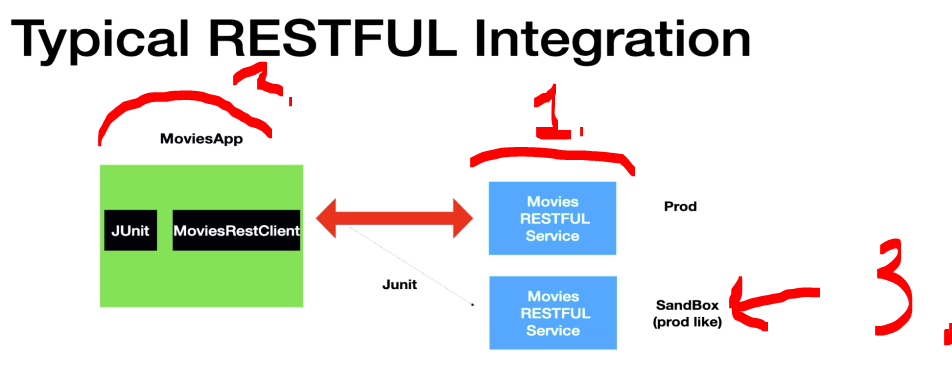
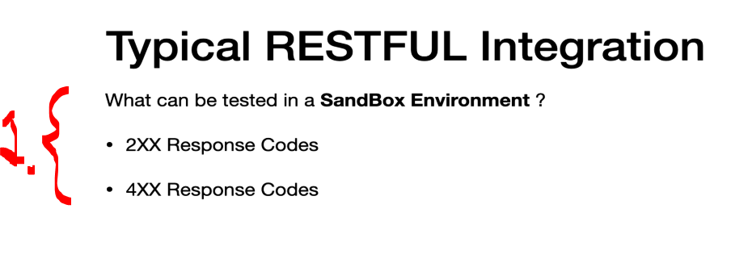
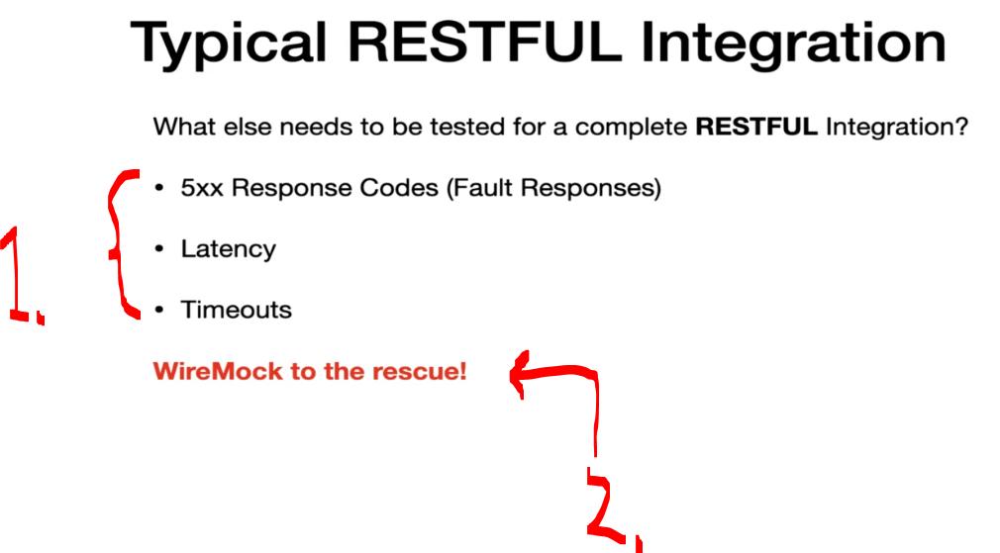
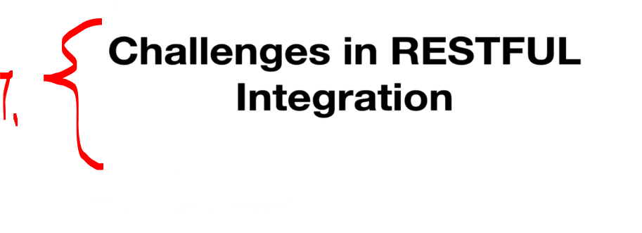
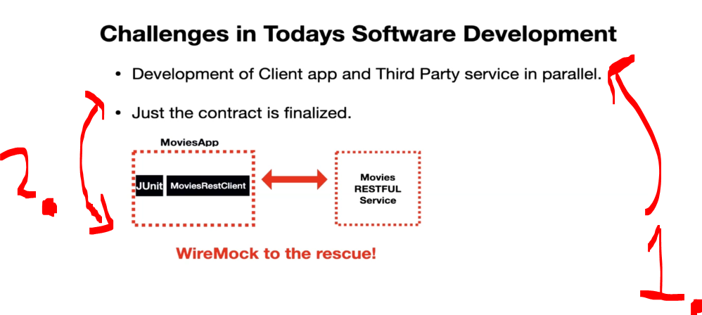
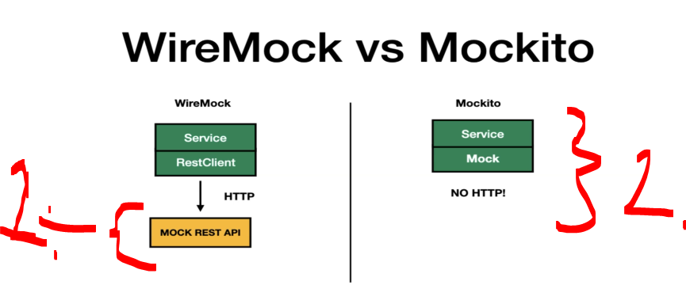
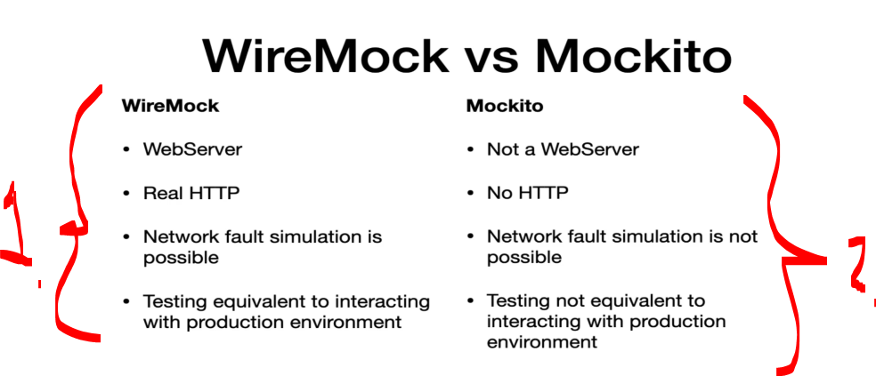

# Section 02: Introduction to WireMock. 

# What I Learned

# Why WireMock?  

    

1. Why we need **WireMock**, and what it solves!

    

1. Most **enterprise** business are already transferred into **Microservice Architecture**.
2. Restful API's are nowadays the thing!
3. Unit test are mandatory!
    - There is less fear, when shipping features when there are automated test!

    

1. There is client and server. They access each other using endpoints using **HTTP** in internet.
    - This **RESTFUL**:ness is easy to expose and make.

    

1. The Movies RESTFUL Services is **third party** company providing services.
2. **MoviesApp** is our client application! 
    - We will have `MoviesRestClient`, in which the **REST API** calls will be made!
- We will have automated test to check for integration for as expected, this is done with **JUnit**.
3. Third party will have third party sandbox environment.
    - This is like **production like environment**.

    

1. What can be tested inside **sandbox environment**.
    - **2xx responses** and **4xx response**!

> [!IMPORTANT]  
>  Just to test these **4xx** and **2xx** are not enough to for a **successful integration**!

    

1. **Three most** important to be tested!
    - **5xx Responses** these are **default** or **fault** responses!
    - **Latency** from the RESTFUL service.
    - **Timeouts** from the **client side** after request have been made!
    - These are **nearly impossible** be tested in **sandbox environment**!
2. **WireMock** comes in handy in these situations!

    

1. Some challenges, when **integrating API's**.

    

1. Usually we have time pressure, where we are making these **parallel** client part and the **third party side**!
2. We are usually created the **contract** first!

    

1. If the **sandbox** environment changed the **contract** in the middle, our **JUnit** would be failing in the `moviesapp` in such scenarios!
    - **Wiremock** has tools for dealing with such scenarios!  

    

1. We have **Service A**, which would be communication on the **Service B**, **Service C** and **Service D**.
    - We would need to write integration test to the **Service A** in same time.
        - It would fail if one of services would be unavailable!

2. Sometimes we would be building these services **parallel** with each other. How one can write test cases in same time. 

    

1. **WireMock** can provide the server virtualization. 
    - We can be **interactive** with these, like it would be real service.

    

1. **WireMock** helps simulate HTTP **REST** responses that do not exist.
2. Can provide these for the caller:
    - Instead of calling real APIs, tests use fixed (mocked) responses.
    - Simulate Fault HTTP Responses:
        - **404** (Not Found).
        - **500** (Server Error).
        - **Invalid payloads**.
    - Simulate Timeout, can delay responses long enough to trigger client timeout handling.
    - Simulate Latency, adds artificial delay to test how the application behaves with slow APIs.

# What is WireMock?  

    

1. One can think the **WireMock** is **Mockito** for HTTP request, but way it works it is different!
2. Since its **server**, it can be interacted with!
    - `HttpResponse` and `HttpRequest` is configured by the developer!

    

1. We can define **Stubs** in programmatically!
2. **Stubs** in **WireMock** context refers to combination of the `HttpResponse` and `HttpRequest`.

    

1. **WireMock**, should **ONLY** be ran in the testing context!

    

1. **WireMock** has two modes:
    - Embedded!
    - Standalone Mode!

    

1. **WireMock** will be ran with the **application** and with the **test cases**!
2. Once the test cases are done, the **WireMock** server will be shutdown!

    

1. One uses the **StandAlone** mode, when the server is running outside the application!
Why?
    - If the application is not **Java** application, and one would want to **mock** the **server** part!

# WireMock vs Mocking Libraries.

    

    

1. **WireMock** is more **simulation** for the service!
2. **Mockito** does the same, but they server different idea:
    - **Mockito** mocks objects!
    - **WireMock** mocks external HTTP service!

    

1. With the **WireMock**, one just needs to replace the **server**, with the **mock REST API**.
    - Our code will be interacting with our mock server.
        - We just need to change the **URL** and the **port**.
2. **Mockito** does not have any **HTTP**!

    

1. **WireMock**:
    - WebServer.
    - Real HTTP. 
    - Network fault simulation is possible.
    - Testing equivalent to interacting with production environment.

2. **Mockito**:
    - Not a WebServer.
    - No HTTP.
    - Network fault simulation is not possible.
    - Testing not equivalent to interacting with production environment.
+