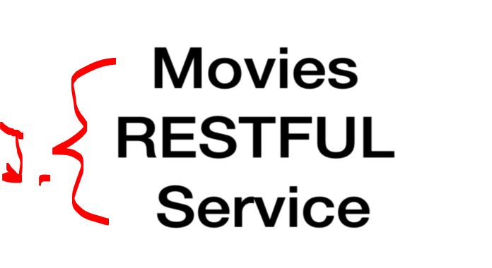
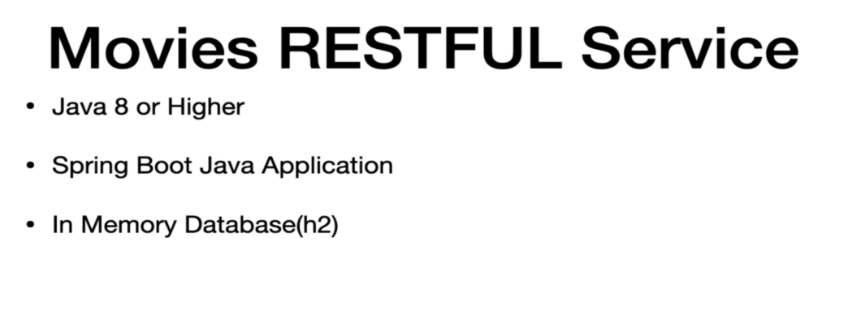
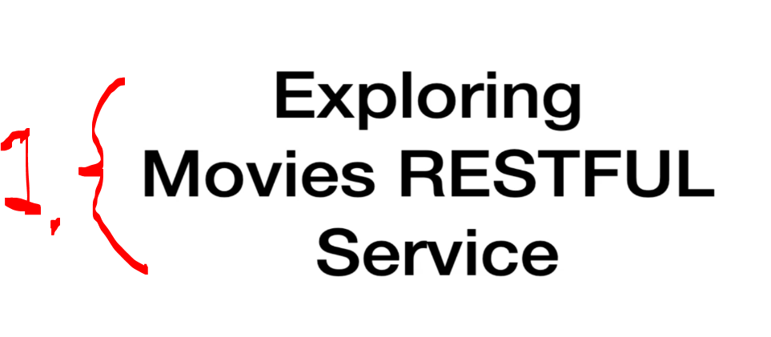

# Section 04: Setting up the Workspace for the Course. 

Setting up the Workspace for the Course.

# What I Learned.

# Overview of the application.

<div align="center">
    
</div>

1. We will be coding `MovieApp` side and the `Movies RESTFUL Service`, will be provided for us as external service!

- Get the repo to our computer! [Repository](https://github.com/dilipsundarraj1/wiremock-for-java-developers).

# Source Code.

- Source code can be found. [Source Code](https://github.com/dilipsundarraj1/wiremock-for-java-developers)!

# Set up the Movies RESTFUL Service.

<div align="center">
    
</div>

1. This chapter we are setting up movies service, in our local machine!

<div align="center">
    
</div>

1. To run this we need:
    - More than Java 8.
    - Spring.
    - It has In Memory Database h2.

- How to Run the app?
    - Run the below command in your machine. You must have java8 or higher to run this application.
    ```
    java -jar movies-restful-service.jar
    ```

- Swagger Link. 
    - The below link will launch the swagger of the `movies-restful-web-service`.
    - http://localhost:8081/movieservice/swagger-ui.html#/

# Exploring the Movies RESTFUL Service [Optional].

<div align="center">
    
</div>

1. We are exploring the **Movies RESTFUL Service**!

- Check the video. There is just different endpoints!

- We will be building REST client to talk with this API.