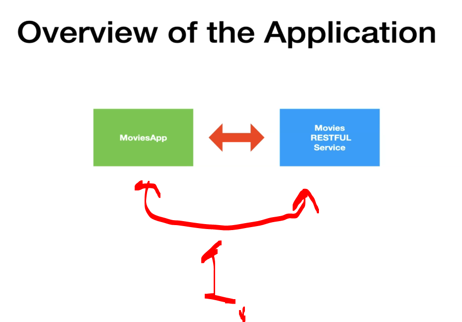

# Section 04: Setting up the Workspace for the Course. 

Setting up the Workspace for the Course.

# What I Learned.

# Overview of the application.

    

1. We will be coding `MovieApp`, the `Movies RESTFUL Service`, will be provided for us!

- Get the repo to our computer! [Repository](https://github.com/dilipsundarraj1/wiremock-for-java-developers).

# Source Code.

# Set up the Movies RESTFUL Service.

# Exploring the Movies RESTFUL Service [Optional].
