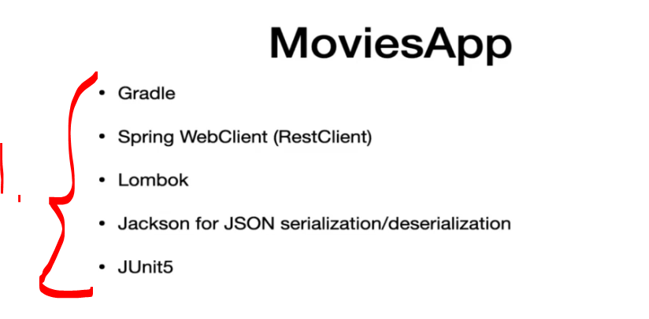
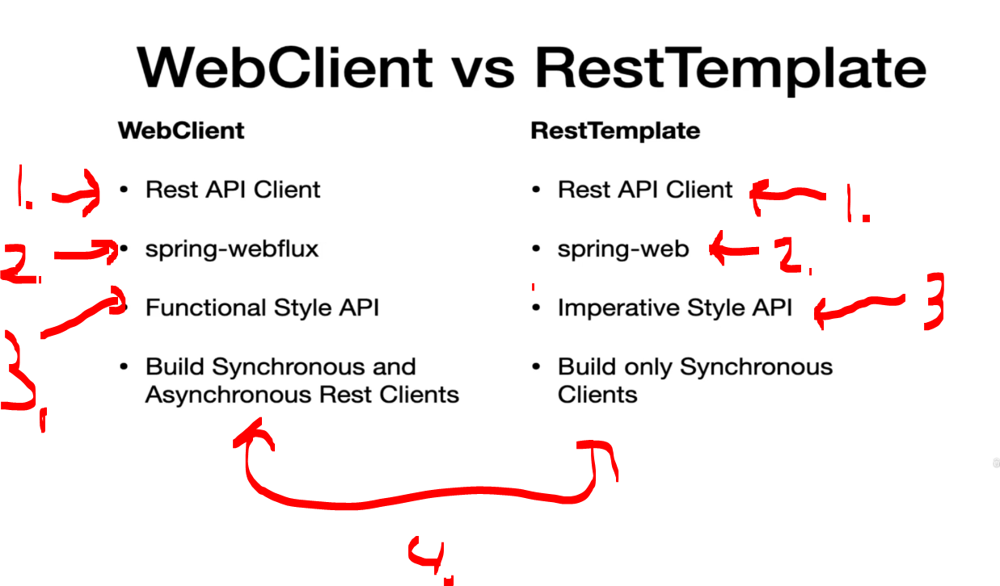
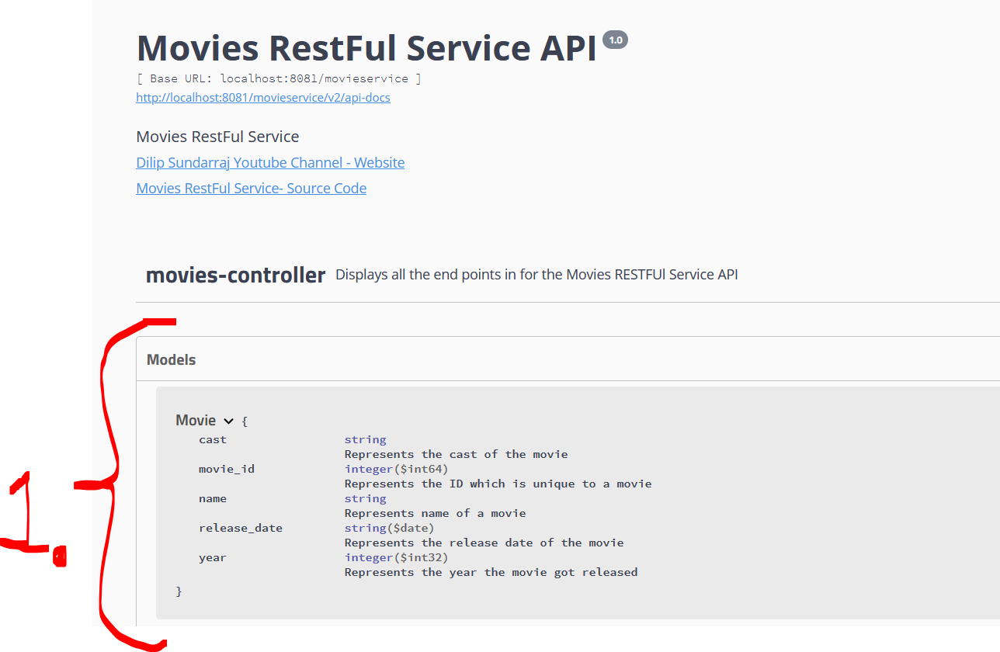
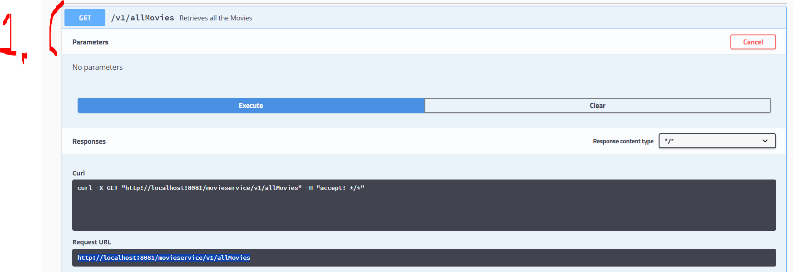
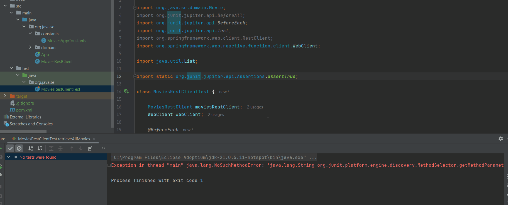
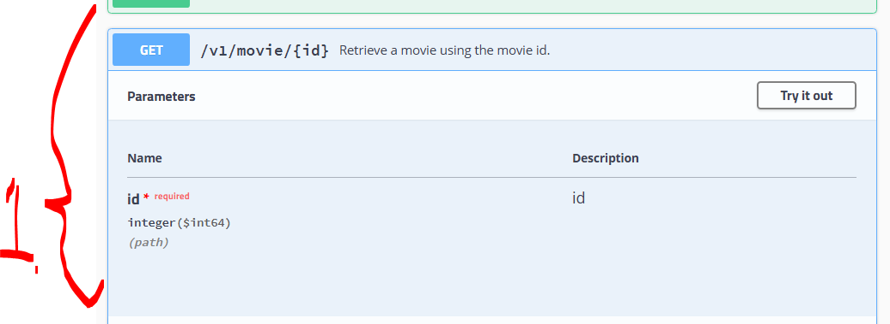

# Section 05: Build RESTFUL Clients using Spring WebClient.

Build RESTFUL Clients using Spring WebClient.

# What I Learned.

# Setting up the Movies App.

- End of this chapter one can use the `movies-app` for the end result.

<div align="center">
    
</div>

1. The **REST** service will have the following specifications!

<details>

<summary id="project init" open="true"> <b>Maven POM - init</b> </summary>

````xml
<project xmlns="http://maven.apache.org/POM/4.0.0" xmlns:xsi="http://www.w3.org/2001/XMLSchema-instance"
         xsi:schemaLocation="http://maven.apache.org/POM/4.0.0 http://maven.apache.org/xsd/maven-4.0.0.xsd">
    <modelVersion>4.0.0</modelVersion>
    <groupId>org.java.se</groupId>
    <artifactId>movies-app</artifactId>
    <version>1.0-SNAPSHOT</version>
    <packaging>jar</packaging>
    <name>movies-app</name>
    <url>http://maven.apache.org</url>
    <properties>
        <project.build.sourceEncoding>UTF-8</project.build.sourceEncoding>
    </properties>

    <dependencies>
        <dependency>
            <groupId>org.springframework.boot</groupId>
            <artifactId>spring-boot-starter-webflux</artifactId>
            <version>3.5.7</version>
        </dependency>
        <!-- Source: https://mvnrepository.com/artifact/org.projectlombok/lombok -->
        <dependency>
            <groupId>org.projectlombok</groupId>
            <artifactId>lombok</artifactId>
            <version>1.18.42</version>
            <scope>compile</scope>
        </dependency>

        <!-- Source: https://mvnrepository.com/artifact/org.junit.jupiter/junit-jupiter-engine -->
        <dependency>
            <groupId>org.junit.jupiter</groupId>
            <artifactId>junit-jupiter-engine</artifactId>
            <version>6.0.2</version>
            <scope>test</scope>
        </dependency>
    </dependencies>
</project>
````

</details>

# RestTemplate vs Spring WebClient.

<div align="center">
    
</div>

1. Both are **REST API** Client's.
2. They are from different **spring libraries**:
    - Other one comes from `spring-webflux`.
    - And other one comes from `spring-web`.

3. Different styles:
    - **Rest Template**, with the **imperative style**:
        <details>
        <summary id="project init" open="true"> <b>Rest template imperative implementation!</b> </summary>

        ````java
        import org.springframework.web.client.RestTemplate;
        import org.springframework.http.ResponseEntity;
        import org.springframework.http.HttpEntity;
        import org.springframework.http.HttpHeaders;
        import org.springframework.http.HttpMethod;

        public class RestTemplateExample {

            public static void main(String[] args) {
                RestTemplate restTemplate = new RestTemplate();
                String url = "https://jsonplaceholder.typicode.com/posts/1";

                // Simple GET request
                ResponseEntity<String> response = restTemplate.getForEntity(url, String.class);
                System.out.println("GET Response: " + response.getBody());

                // POST request with body
                String jsonBody = "{ \"title\": \"foo\", \"body\": \"bar\", \"userId\": 1 }";
                HttpHeaders headers = new HttpHeaders();
                headers.add("Content-Type", "application/json");
                HttpEntity<String> request = new HttpEntity<>(jsonBody, headers);

                ResponseEntity<String> postResponse = restTemplate.postForEntity(
                        "https://jsonplaceholder.typicode.com/posts", request, String.class);
                System.out.println("POST Response: " + postResponse.getBody());
            }
        }
        ````
        </details>

    - **WebClient**, with the **functional style**:
        <details>
        <summary id="project init" open="true"> <b>WebClient functional style implementation!</b> </summary>

        ````java
        import org.springframework.web.reactive.function.client.WebClient;
        import reactor.core.publisher.Mono;

        public class WebClientExample {

            public static void main(String[] args) {
                WebClient webClient = WebClient.create("https://jsonplaceholder.typicode.com");

                // GET request
                Mono<String> getResponse = webClient.get()
                        .uri("/posts/1")
                        .retrieve()
                        .bodyToMono(String.class);

                getResponse.subscribe(response -> System.out.println("GET Response: " + response));

                // POST request
                String jsonBody = "{ \"title\": \"foo\", \"body\": \"bar\", \"userId\": 1 }";

                Mono<String> postResponse = webClient.post()
                        .uri("/posts")
                        .header("Content-Type", "application/json")
                        .bodyValue(jsonBody)
                        .retrieve()
                        .bodyToMono(String.class);

                postResponse.subscribe(response -> System.out.println("POST Response: " + response));

                // Keep app alive to see async responses
                try {
                    Thread.sleep(2000);
                } catch (InterruptedException e) {
                    e.printStackTrace();
                }
            }
        }
        ````
        </details>

4. The `WebClient` we can perform **synchronous and asynchronous** rest clients.
The `RestTemplate` we can only build **synchronous** clients

<div align="center">
    
</div>

1. RestTemplate is [depricated](https://docs.spring.io/spring-framework/docs/current/javadoc-api/org/springframework/web/client/RestTemplate.html)!

# Setting up the Movies Domain.

<div align="center">
    
</div>

1. This is the `Movie` class, which we are going to use to interact with the **movies restful service**!

- We will be writing the domain object:

````Java
package org.java.se;

import lombok.AllArgsConstructor;
import lombok.Data;
import lombok.NoArgsConstructor;

import java.time.LocalDate;

@Data
@NoArgsConstructor
@AllArgsConstructor
public class Movie {
        String cast;
        Long movie_id;
        String name;
        LocalDate release_date;
        Integer year;
}
````

# Build Movies REST Client using Spring WebClient.

<div align="center">
    
</div>

1. We are writing **WebClient** call for this endpoint call!

- There are **two** main ways to get data, with the `WebClient`:
    - Use `retrieve()` when you just want the body and automatic error handling.
    - Use `exchange()` when you need full response control (status, headers, conditional logic).

- **WebClient** is by default **non-blocking client**.
    - We can make it **blocking** with the `.block();`.


- We need to **map** the response body to reactive types:
    - `.bodyToFlux(Movie.class)` if the endpoint is returning **multiple** objects.
    - `.bodyToMono(Movie.class)` if the endpoint is returning **single** objects.

- We have ended up making following `webClient` call:

````Java
    return webClient.get()
                .uri(MoviesAppConstants.GET_ALL_MOVIES_V1)
                .retrieve()
                .bodyToFlux(Movie.class) // If multiple results .bodyToFlux, .bodyToMono() if the result is single object!
                .collectList()
                .block();

````
<details>

<summary id="webclient" open="true"> <b>WebClient call code!</b> </summary>


````Java
package org.java.se;

import org.java.se.constants.MoviesAppConstants;
import org.java.se.domain.Movie;
import org.springframework.web.reactive.function.client.WebClient;

import java.util.List;

public class MoviesRestClient {

    private WebClient webClient;

    // We want this to be initialized from outside the class!
    public MoviesRestClient(WebClient webClient) {
        this.webClient = webClient;
    }

    public List<Movie> retrieveAllMovies()
    {
        return webClient.get()
                .uri(MoviesAppConstants.GET_ALL_MOVIES_V1)
                .retrieve()
                .bodyToFlux(Movie.class) // If multiple results, .bodyToMono() if the result is single object!
                .collectList()
                .block();
    }
}
````
</details>

# Build Movies REST Client test using JUnit.

- We will be writing **Junit** test's for the endpoint call logic:

````Java
package org.java.se;

import org.java.se.domain.Movie;
import org.junit.jupiter.api.BeforeAll;
import org.junit.jupiter.api.BeforeEach;
import org.junit.jupiter.api.Test;
import org.springframework.web.client.RestClient;
import org.springframework.web.reactive.function.client.WebClient;

import java.util.List;

import static org.junit.jupiter.api.Assertions.assertTrue;

class MoviesRestClientTest {

    MoviesRestClient moviesRestClient;
    WebClient webClient;

    @BeforeEach
    void setUp()
    {
        String baseUrl = "http://localhost:8081";
        webClient = WebClient.builder()
                .baseUrl(baseUrl)
                .build();
        moviesRestClient = new MoviesRestClient(webClient);
    }

    @Test
    // We are testing call to the method!
    void retrieveAllMovies(){

        // Given.

        // When.
        List<Movie> movies = moviesRestClient.retrieveAllMovies();
        System.out.println("moviesList: " + movies);

        // Then.
        assertTrue(movies.size() >= 0 );
    }
}
````

- We are getting **10 results**, like below:

<div align="center">
    
</div>

1. One can see **10** items getting retrieved form in mememory database when endpoint is called!

# WebClient - Retrieve Movie by Movie-ID.

<div align="center">
    
</div>

1. We are ...


# WebClient - Retrieve Movie by Movie-Name.

# WebClient - Retrieve Movie By Year.

# WebClient - Add a new Movie - HTTP POST.

# WebClient - Update a Movie - HTTP PUT.

# WebClient - Delete a Movie - HTTP DELETE.
